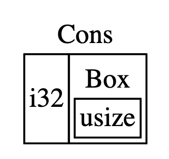
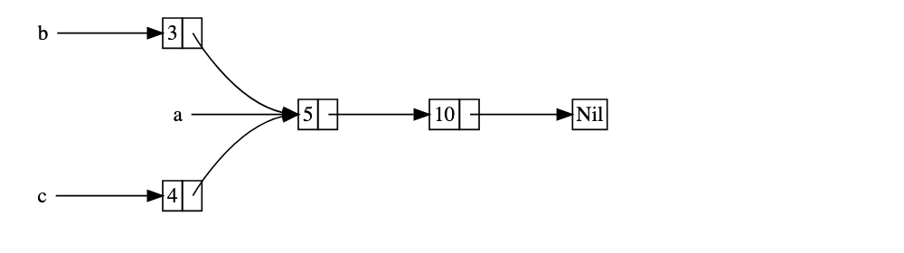
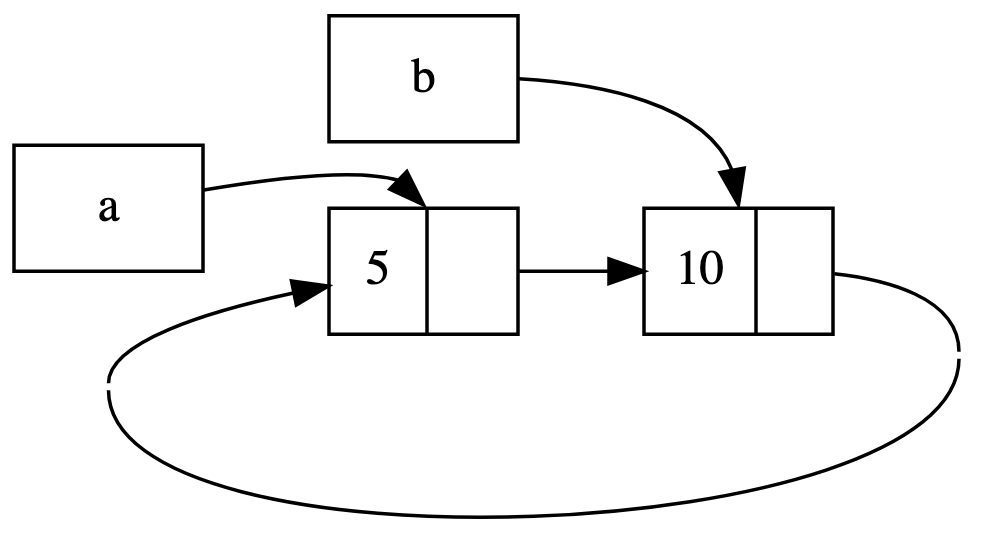

# Smart Pointers

Tags: Box, Deref, Drop, Interior Mutability, RefCell, Weak, rc
Created time: August 13, 2023 6:38 PM
Last edited time: August 17, 2023 8:20 PM
Status: Done

- Table of Contents

## Introduction

- A `pointer` is a general concept for a variable that contains an address in memory that “points at” some other data
- The most common type of pointer in Rust is a reference, indicated by `&` and that borrow the value that they point to. These have no special capabilities and have no overhead
- *Smart Pointers* on the other hand, are data structures that act like a pointer but also have additional metadata and capabilities
- This feature is not unique to Rust, and in fact, originated in C++ and exists i other languages as well
- Rust, with its concept of ownership and borrowing, has an additional difference between references and smart pointers — while references only borrow data, in many case, smart pointers own the data they point to
- `String` and `Vec<T>` are also smart pointers!
- Smart pointers are usually implemented using structs but unlike an ordinary struct, they implement `Deref` and `Drop` traits
- The `Deref` trait allows an instance of smart pointer struct to behave like a reference so that you can write code to work with either references or smart pointers
- The `Drop` trait allows you to customize the code that’s run when an instance of the smart pointer goes out of scope
- This chapter only covers the most common smart pointers available in Rust’s standard library:
    - `Box<T>` for allocation values on the heap
    - `Rc<T>` a reference counting type that enables multiple ownership
    - `Ref<T>` and `RefMut<T>` , accessed through `RefCell<T>`, a type that enforces the borrowing rules at runtime instead of compile time
- This chapter also covers:
    - `interior mutability` pattern where an immutable type exposes an API for mutating an interior value
    - `reference cycles`: how they leak memory and how to prevent them

## Using `Box<T>` to point to Data on the Heap

- Boxes allow you to store data on the heap rather than on the stack
- What remains on the stack is the pointer to the heap data
- They have no performance overhead other than storing their data on the heap rather than the stack
- But they don’t have many extra capabilities either
- Boxes can be used in the following situations:
    - When you have a type whose size cannot be known at compile time and you want to use a value of that type in a ocntext that requires an exact size
    - When you have a large amount of data and you want to transfer ownership but ensure the data won’t be copied when you do so
    - When you want to own a value and you care only that it’s a type that implements a particular trait rather than being of a specific type

### Storing Data on the Heap

- Syntax:
    
    ```rust
    fn main() {
        let b = Box::new(5);
        println!("b = {b}");
    }
    ```
    
    Here, the value `5` is stored on the heap and `b` stores the address on the heap where this value exists
    
    When `b` goes out of scope, both the box (stored on the stack) and the data it points to are deallocated
    
### Enabling Recursive Types with Boxes

- A value of recursive type can have another value of the same type as part of itself
- Recursive types are an issue because Rust needs to know at compile time how much space a type takes up.
- However, the nesting of values of recusive types could theoretically continue infinitely, so Rust can’t know how much space the value needs
- Because boxes have a known size, we can enable recursive types by inserting a box in the recursive type definition
- As an example, let’s explore how a `cons list` can be implemented in Rust

#### More about the Cons list

- This is a data type commonly found in functional programming languages — in fact, it comes from the Lisp programming language and its dialects
- It is the Lisp version of a linked list
- Its name comes from the `cons` function (short for `construct function`) in Lisp that constructs a new pair from its two arguments
- By calling `cons` on a pair consisting of a value and another pair, we can construct cons lists made up of recursive pairs:
    
    ```rust
    (1, (2, (3, Nil)))
    ```
    
- Each item of a cons list contains two elements: the value of the current item and the next item
- The last item in the list contains only a value called `Nil` without a next item
- A cons list is constructed by recursively calling the cons function
- The canonical name to denote the base case of the recursion is `Nil` (not to be confused with `null` or `nil` which is an invalid or absent value)
- Translated to Rust, here is the enum definition of a cons list:
    
    ```rust
    enum List {
    	Cons(i32, List),
    	Nil,
    }
    ```
    
    This code does not compile yet because the `List` type doesn’t have a known size
    
- We want to construct our list as:
    
    ```rust
    use crate::List::{Cons, Nil};
    fn main() {
        let list = Cons(1, Cons(2, Cons(3, Nil)));
    }
    ```
    
- If we try to compile this, we’ll get the following error message:
    
    ```rust
    error[E0072]: recursive type `List` has infinite size
     --> src/lib.rs:1:1
      |
    1 | enum List {
      | ^^^^^^^^^
    2 |     Cons(i32, List),
      |               ---- recursive without indirection
      |
    help: insert some indirection (e.g., a `Box`, `Rc`, or `&`) to break the cycle
      |
    2 |     Cons(i32, Box<List>),
      |               ++++    +
    ```
    
    This error shows that our `List` enum has an infinite size because we have defined it recursively
    
#### Computing the Size of a non-recursive Type

- Take our message enum from previous chapters:
    
    ```rust
    enum Message {
    	Quit,
    	Move { x: i32, y: i32 },
    	Write(String),
    	ChangeColor(i32, i32, i32),
    }
    ```
    
- To determine how much space needs to be allocated for a `Message` value, Rust goes through each of the variants to see which variant needs most space
- Here, Rust sees that that:
    - `Quit` does not require any space
    - `Move` needs enough space to store two `i32` values, and so on
- In contrast, Rust cannot determine the size of the `List` enum because it has to first determine the size of the `Cons` variant but the `Cons` variant itself contains a `List` and this goes on and on!

#### Using `Box` to get a Recursive Type with a Known Size

- In the compiler’s error message suggestion, rust tells us to use `indirection`
- `indirection` means that instead of storing a value directly, we should change the data structure to store the value indirectly by storing a pointer to the value instead
- Because a `Box<T>` is a pointer, Rust always know how much space a `Box<T>` needs: a pointer’s size doesn’t chagne based on the amount of data it’s pointing to
- This means, that we can use a `Box<List>` for the `Cons` variant
- Conceptually, we still have a list, created with lists holding other lists, but this implementation is now more like placing items next to one another rather than inside one another
- So, the definition becomes:
    
    ```rust
    pub enum List {
        Cons(i32, Box<List>),
        Nil,
    }
    ```
    
- Inside main:
    
    ```rust
    use cons::List::{Cons, Nil};
    
    fn main() {
        let list = Cons(1, Box::new(Cons(2, Box::new(Cons(3, Box::new(Nil))))));
    }
    ```
    
- By using a Box, we have broken the infinite, recursive chain, so the compiler can figure out the size it needs to store a `List` value:
    
    
    
- Boxes only provide indirection and heap allocation, they don’t have any other special capabilities
- They also don’t have the performance overhead that other special capabilities incur, so they can be useful in cases like these where indirection is all we need

### Quiz

1. Determine whether the program will pass the compiler. If it passes, write the expected output of the program if it were executed.
    
    ```rust
    fn main() {
        let mut n = 1;
        let b = Box::new(&mut n);
        **b += 1;
        println!("{}", n);
    }
    ```
    
    - Ans

        This program DOES compile to give the output `2`

        Think of a `Box` like an `&`. Then, we have `b = &&mut n` which needs double dereferencing to get the stored mutable value that is then incremented

2. Say we have a program with a variable:
    
    ```rust
    let x: [Box<(usize, usize)>; 4] = /* ... */
    ```
    
    For a compile target with a 64-bit architecture, what is the minimum possible size in memory (in bytes) of `x` on the stack? Write your answer in digits, e.g. 0, 1, so on.
    
    - Ans

        32

        **Context**: A box contains a pointer, which is 8 bytes on a 64-bit architecture. An array of 4 pointers is therefore at least 4 * 8 = 32 bytes.

## Treating Smart Pointers Like Regular References with `Deref` Trait

- Implementing the `Deref` trait allow us to customize the behavior of the *dereference* operator `*`
- By implementing this trait in such a way that a smart pointer can be treated like a regular reference, you can write code that operates on references and use that code with smart pointers
- There are some differences in terms of how the dereference works for `Box<T>` by default, compared to regular references
- We’ll first try to implement our own `MyBox<T>` that does not store data on the heap but where we can implement the `Deref` trait to exhibit its features

### Following the Pointer to the Value

- A regular reference is a type of pointer — an arrow to a value that is stored somewhere else
- Example:
    
    ```rust
    let x = 5;
    let y = &x;
    
    assert_eq!(5, x);
    assert_eq!(x, *y);
    ```
    
    Here, we can assert that `x` has the value equal to `5` but if we want to make an assertion on `y` (that holds a reference to `x`), we have to use `*y` to follow the reference to the value it’s pointing to so the compiler can compare the actual value
    
### Using `Box<T>` Like a Reference

- We can rewrite the above code as:
    
    ```rust
    let x = 5;
    let y = Box::new(x);
    
    assert_eq!(5, x);
    assert_eq!(x, *y);
    ```
    
    The only difference in this code compared to the previous is that here, we set `y` to be an instance of a `Box<T>` pointing to a copied vlaue of `x` rather than a reference pointing to a value of `x`
    
### Defining Our Own Smart Pointer

- Let’s define our own smart pointer that implements `new` and holds a `tuple` struct type:
    
    ```rust
    struct MyBox<T>(T);
    
    impl<T> MyBox<T> {
        fn new(x: T) -> MyBox<T> {
            MyBox(x)
        }
    }
    ```
    
    We can test this implementation as well:
    
    ```rust
    #[test]
    fn test_mybox_ref() {
        let x = 5;
        let y = MyBox::new(x);
    
        assert_eq!(5, x);
        assert_eq!(x, *y);
    }
    ```
    
    However, this test does not even compile! We get the following error:
    
    ```rust
    error[E0614]: type `MyBox<{integer}>` cannot be dereferenced
      --> src/lib.rs:37:23
       |
    37 |         assert_eq!(x, *y);
       |                       ^^
    ```
    
- Here, our smart pointer cannot be dereferenced because we haven’t implemented that ability, specifically the `Deref` trait

### Treating a Type Like a Reference by Implementing the `Deref` Trait

- The `Deref` trait is defined in the standard library and requires us to implement on method named `deref` that borrows `self` and returns a reference to the inner data
- Let’s implement this trait for our smart pointer:
    
    ```rust
    impl<T> Deref for MyBox<T> {
        type Target = T;
    
        fn deref(&self) -> &Self::Target {
            &self.0
        }
    }
    ```
    
- Here, `type Target = T` syntax defines an associated type for the `Deref` trait to use. Associated types are a slightly different way of declaring a generic parameter (more on them later)
- The body of the `deref` function contains `&self.0` so that we return the reference to the value we wish to access via `Deref`
- Without an implementation of the `Deref` trait, the compiler can only derefence `&` references.
- The `deref` method gives the compiler the ability to take a value of any type that implements `Deref` and call the `deref` method to get an `&` reference that it knows how to dereference
- So, `*y` in the previous code examples are actually interpreted by the compiler as:
    
    ```rust
    *(y.deref())
    ```
    
- The `deref` method then returns a plain `&` reference that can be dereferenced
- The reason we still need the `*` operator after the call to `deref` has to do with Rust’s ownership system:
    - If the `deref` method returned the value directly instead of a reference to the value, the value would be moved out of `self` — which we do not want when derefencing

### Implicit Deref Coercions With Functions and Methods

- `Deref coercion` converts a reference to a type that implements the `Deref` trait into a reference to another type
- For example, deref coercion can convert `&String` to `&str` because `String` implements the `Deref` trait such that it returns `&str`
- Deref coercion is a convenience Rust performs on arguments to functions and methods, and works only on types that implement the `Deref` trait
- This happens automatically when we pass a reference to a particular type’s value as an argument to a function or method that doesn’t match the parameter type in the function or method definition
- A sequence of `deref` method calls converts the type we provided into the type the parameter needs
- This implicit coercion was added to Rust so that programmer writing function and method calls don’t need as many explicit references and dereferences with `&` and `*`. This also allows us to write code that works for both references and smart pointers
- Let’s write a funciton to illustrate this:
    
    ```rust
    fn hello(name: &str) {
        println!("Hello, {name}");
    }
    ```
    
    We can call this function on our `my_box` smart pointer directly without needing explicit dereferences:
    
    ```rust
    let m = MyBox::new(String::from("Rust"));
    hello(&m);
    ```
    
    Here, `&m` is a reference to a `MyBox<String>` value but because we implemented the `Deref` trait on it, Rust is able to dereference it to get a reference to the underlying `String`. `String` also implements `Deref` to return the `&str`. So the actual call looks like the following:
    
    ```rust
    hello(&(*m)[..]);
    ```
    
    Here,
    
    - `*m` dereferences `MyBox<String>` into a `String`
    - `[..]` takes a string slice of the `String` that is equal to the whole string
    - `&` gets the reference to the `str` to match the function signature of `hello`
- Without deref coercion, this function would be harder to read, write and understand with all of these symbols involved
- When the `Deref::deref` is defined for the types involved, Rust will analyze the types and use `Deref::deref` as many times as necessary to get a reference to match the parameter’s type — this is resolved at compile time, so there is no runtime penalty for taking advantage of deref coercion!

### How `Deref Coercion` interacts with Mutability

- Similar to how we can use the `Deref` trait to override the `*` operator on immutable references, we can use the `DerefMut` trait to override the `*` operator on mutable references
- Rust does deref coercion when it finds types and trait implementations in three cases:
    
    | From | To | Condition |
    | --- | --- | --- |
    | &T | &U | T: Deref<Target=U> |
    | &mut T | &mut U | T: DerefMut(Target=U> |
    | &mut T | &U | T: Deref<Target=U> |
- The first two cases are identical except the mutabiity aspect
- The third case is trickier:
    - Rust will also coerce a mutable reference to an immutable one
    - But the reverse is **not** possible: immutable references will never coerce to mutable references
    - Because borrowing rules dictate that if you have a mutable reference, that mutable reference must be the only reference to that data
    - Converting a mutable reference to an immutable one does not break that rule
    - Converting an immutable reference to a mutable one would require that the initial immutable reference is the only immutable reference to that data
    - Borrowing rules cannot guarantee this and so Rust cannot assume that converting an immutable reference to a mutable reference is possible

### Quiz

1. Determine whether the program will pass the compiler. If it passes, write the expected output of the program if it were executed.
    
    ```rust
    use std::ops::Deref;
    #[derive(Clone, Copy)]
    struct AccessLogger(i32);
    impl Deref for AccessLogger {
        type Target = i32;
        fn deref(&self) -> &Self::Target {
            println!("deref");
            &self.0
        }
    }
    fn main() {
      let n = AccessLogger(-1);
      let x = *n + 1;
      let n2 = n;
      println!("{} {}", x, *n)
    }
    🐞
    ```
    
    - Ans

        ```rust
        deref
        deref
        0 -1
        ```

        The deref is done twice (once in assignment to `x` and another in the `println!`)

2. Consider the use of deref coercions in the expression `b.len()`:
    
    ```rust
    let s = &mut String::new();
    let b = &Box::new(s);
    b.len()
    ```
    
    Which of the following is the fully expanded expression that is passed to `str::len(..)`?
    
    - Ans

        `&(*b).deref()[..]`

        **Context**:

        - First, the outer reference (before `Box`) is dereferenced creating `(*b)`.
        - Then the `Box` is dereferenced creating `(*b).deref()`.
        - Then the type `&mut String` is converted to `&str` by adding `&` and `[..]`, creating `&(*b).deref()[..]`.

## Running Code on Cleanup with the `Drop` Trait

- `Drop` lets you customize what happens when a value is about to go out of scope
- This is almost always used when implementing a Smart Pointer
- In some languages, for some types, it falls on the programmer to call code to free memory or resources every time they finish using an instance of those types
- Examples include: file handles, sockets, or locks
- Forgetting to release these resources could lead to overloads and crashes
- In Rust, we can define what code to run when a value goes out of scope, and the compiler automaitcally inserts this cleanup code at run time
- We can specify this cleanup code by implementing the `Drop` trait — that requires you to implement one method named `drop` that takes a mutable refernce to `self`
- To see when the `drop` function is call, let’s implement it with `println!` call:
    
    ```rust
    struct CustomSmartPointer {
        data: String,
    }
    
    impl Drop for CustomSmartPointer { // Drop trait is included in the prelude; no need to import
        fn drop(&mut self) {
            println!("dropping custom smart pointer with data `{}`", self.data);
        }
    }
    ```
    
    Now when we execute the following function:
    
    ```rust
    fn drop_test() {
        let _c = CustomSmartPointer {
            data: String::from("my stuff"),
        };
        let _d = CustomSmartPointer {
            data: String::from("my other stuff"),
        };
    
        println!("CustomSmartPointers Created");
    }
    ```
    
    we get the following output:
    
    ```rust
    CustomSmartPointers Created
    dropping custom smart pointer with data `my other stuff`
    dropping custom smart pointer with data `my stuff`
    ```
    
- Notice that `_d` is dropped before `_c` i.e, in the reverse order of their creation

### Dropping a Value Early with `std::mem::drop`

- The whole point of `Drop` is that it is executed automatically. So, it’s not straightforward to disable this default behavior
- Occasionally, however, you might want to drop the value early
- One example is when using smart pointers that manage locks: you might want to force the `drop` method that releases the lock so that other code in the same scope can acquire the lock
- Rust doesn’t let you call the `Drop` trait’s `drop` method manually; instead you have to call the `std::mem::drop` function provided by the standard library (which is also included in the prelude so can be called directly)
- The `drop` function is a type of *destructor* in Rust
- Example:
    
    ```rust
    fn drop_test() {
        let _c = CustomSmartPointer {
            data: String::from("my stuff"),
        };
        let _d = CustomSmartPointer {
            data: String::from("my other stuff"),
        };
    
        println!("CustomSmartPointers Created");
    
        drop(_c);
        println!("CustomSmartPointer _c dropped before end of scope");
    }
    ```
    
    The output of the above code is:
    
    ```rust
    CustomSmartPointers Created
    dropping custom smart pointer with data `my stuff`
    CustomSmartPointer _c dropped before end of scope
    dropping custom smart pointer with data `my other stuff`
    ```
    
    Here, `_c` is dropped explicitly which changes the order of execution of `drop` that the compiler invokes automatically
    
- This feature of Rust makes it awfully convenient for us to implement our own allocators; while not having to worry about when or how deallocation occurs
- Combined with Rust’s ownership system, we also don’t have to worry about free-ing issues — Rust ensures that `drop` is called only once per value

### Quiz

1. Determine whether the program will pass the compiler. If it passes, write the expected output of the program if it were executed.
    
    ```rust
    struct Example(i32);
    impl Drop for Example {
        fn drop(&mut self) {
            self.0 += 1;
            println!("drop {}", self.0);
        }
    }
    fn main() {
        let e = Example(0);
        drop(e);
        drop(e);
    }
    ```
    
    - Ans

        This program **does not** compile.

        **Context**: An owned value cannot be dropped twice, so it is a compiler error to call a drop the second time.

2. Consider this snippet that allocates a string:
    
    ```rust
    fn main() {
        let mut s = String::new();
        ____
    }
    ```
    
    Which of the following are valid operations to fill in the underscore that would cause `s` to be dropped?
    
    - Ans
        - `(|_| ())(s);`
        - `drop(s);`
        - `{ s };`

        **Context**: Any use of `s` that moves it and discards the result will cause `s` to be dropped. However, `s.drop()` cannot be called directly.

## `Rc<T>`, the Reference Counted Smart Pointer

- In a majority of cases, ownership is clear: you know exactly which variable owns a given value
- However, there are cases when a single value might have multiple owners
- For example, in graph data structures where
    - multiple edges might point to the same node, and
    - that node is *conceptually* owned by all of the edges that point to it
- In such cases, we have to enable multiple ownership explicitly by using the Rust type `Rc<T>`, which is an abbreviation for `reference counting`
- The `Rc<T>` type keeps track of the number of references to a value to determine whether or not the value is still in use
- If there are zero references to a value, the value can be cleaned up without any references becoming invalid

<aside>
💡 Imagine `Rc<T>` as a TV in a family room. When one person enters to watch TV, they turn it on. Others can come into the room and watch the TV. When the last person leaves the room, they turn off the TV because it’s no longer being used. If someone turns off the TV while others are still watching it, there would be uproar from the remaining TV watchers!

</aside>

- We use `Rc<T>` type when we want to allocate some data on the heap for multiple parts of our program to read and we can’t determine at compile time which part will finish using the data last
- If you knew which one would read last, we could assign ownership of the data to this reader and Rust’s ownership rules would do the rest
- Note that this is only for use in single-threaded scenarios

### Using `Rc<T>` to Share Data

- Let’s reuse the cons list example, but with the caveat that two such lists will both share ownership of a third list:
    
    
    
- With our previous definition of cons list, we’d implement the above structure this way:
    
    ```rust
    let a = Cons(5, Box::new(Cons(10, Box::new(Nil))));
    let b = Cons(3, Box::new(a));
    let c = Cons(4, Box::new(a));
    ```
    
    However, the above does not compile:
    
    ```rust
    error[E0382]: use of moved value: `a`
     --> src/main.rs:9:30
      |
    7 |     let a = Cons(5, Box::new(Cons(10, Box::new(Nil))));
      |         - move occurs because `a` has type `cons::List`, which does not implement the `Copy` trait
    8 |     let b = Cons(3, Box::new(a));
      |                              - value moved here
    9 |     let c = Cons(4, Box::new(a));
      |                              ^ value used here after move
    ```
    
- This error occurs because the `Cons` variants own the data they hold
- We could change the definition of `Cons` to hold references instead, but then we would have to specify lifetime parameters
- By specifying lifetime paramters, we would be specifiying that every element in the list will live at least as long as the entire list — this is true for this particular case but not always
- So, we’ll change the definition of `List` to use `Rc<T>` in place of `Box<T>`:
    
    ```rust
    // src/lib.rs
    use std::rc::Rc;
    
    #[derive(Debug)]
    pub enum List {
        Cons(i32, Box<List>),
        Nil,
    }
    
    #[derive(Debug)]
    pub enum RcList {
        Cons(i32, Rc<RcList>),
        Nil,
    }
    
    // src/main.rs
    use std::rc::Rc;
    
    use cons::{
        List::{Cons, Nil},
        RcList::Nil as RcNil,
        RcList::{self, Cons as RcCons},
    };
    
    fn main() {
        let list = Cons(1, Box::new(Cons(2, Box::new(Cons(3, Box::new(Nil))))));
        println!("List: {list:?}");
    
    		// define a new instance of RcList
        let a: RcList = RcCons(5, Rc::new(RcCons(10, Rc::new(RcNil))));
    		// convert to Rc<T> pointing to `a`, reference count to `a` becomes 1
        let rca: Rc<RcList> = Rc::new(a);
    
    		// clone rca `Rc<RcList>`, to increase reference count to `a` from 1 to 2
        let b: RcList = RcCons(3, Rc::clone(&rca));
    		// clone rca `Rc<RcList>` again, to increase reference count to `a` from 2 to 3
        let c: RcList = RcCons(4, Rc::clone(&rca));
    }
    ```
    
- Here:
    - `List` has ben redefined to use `Rc` instead of `Box` (`Rc` needs to be brought into the scope as it is not included in the prelude)
    - Each `Cons` variant now holds a value and an `Rc<T>` pointing to an `RcList`
    - When we create `b`, instead of taking ownership of `rca`, we clone the `Rc<RcList>` that `rca` is holding, thereby increasing the number of references from one to two and letting `rca` and `b` share ownership of the data in that `Rc<RcList>`
    - We also clone `rca` when creating `c`, thereby increasing the number of references from two to three

<aside>
💡 Every time we call `Rc::clone`, the reference count to the data within the `Rc<RcList>` will increase, and the data won’t be cleaned unless there are zero references to it. This clone is more idiomatic than `rca.clone()` and is preferred as it does not deep copy data like most data structures but only increases the reference count!

</aside>

### Cloning `Rc<T>` Increases the Reference Count

- We can observe the reference counts change as we create and drop references to the `Rc<RcList>` (`rca`)
- We’ll add braces around `c` to observe how the count changes:
    
    ```rust
    // define a new instance of RcList
    let a: RcList = RcCons(5, Rc::new(RcCons(10, Rc::new(RcNil))));
    // convert to Rc<T> pointing to `a`, reference count to `a` becomes 1
    let rca: Rc<RcList> = Rc::new(a);
    println!("count after creating rca = {}", Rc::strong_count(&rca));
    
    // clone rca `Rc<RcList>`, to increase reference count to `a` from 1 to 2
    let b: RcList = RcCons(3, Rc::clone(&rca));
    println!("count after creating b = {}", Rc::strong_count(&rca));
    {
        // clone rca `Rc<RcList>` again, to increase reference count to `a` from 2 to 3
        let c: RcList = RcCons(4, Rc::clone(&rca));
        println!("count after creating c = {}", Rc::strong_count(&rca));
    }
    
    println!(
        "count after c goes out of scope = {}",
        Rc::strong_count(&rca)
    );
    ```
    
    The above outputs:
    
    ```rust
    count after creating rca = 1
    count after creating b = 2
    count after creating c = 3
    count after c goes out of scope = 2
    ```
    
- In the above program, we can get the reference count using the `strong_count()` function that accepts a reference to an `Rc<T>`
- This function is named so because there is also another function called `weak_count()` that is used for preventing reference cycles (discussed later)
- From the above output, we can see that each call to `clone()` increases the reference count while the dropping of any reference (here, `c`) decreases the count
- Via immutable references, `Rc<T>` allows us to share data between multiple parts of our program for reading only
- Immutability ensures that Rust’s ownership rules are not violated.
- However, there are cases when we would like to mutate the shared values — that is where `RefCell<T>` and the interior mutability pattern comes in!

### Quiz

1. Determine whether the program will pass the compiler. If it passes, write the expected output of the program if it were executed.
    
    ```rust
    use std::rc::Rc;
    fn main() {
        let n = Rc::new(1);
        let mut n2 = Rc::clone(&n);
        *n2 += 1;
        println!("{}", n);
    }
    ```
    
    - Ans

        The program **DOES NOT** compile

        **Context**: Data inside an `Rc` cannot be mutated without the use of interior mutability (seen next section). `Rc` enforces this property by implementing the `Deref` trait, but not implementing the `DerefMut` trait.

2. Determine whether the program will pass the compiler. If it passes, write the expected output of the program if it were executed.
    
    ```rust
    use std::rc::Rc;
    struct Example;
    impl Drop for Example {
        fn drop(&mut self) {
            println!("drop");
        }
    }
    fn main() {
        let x = Rc::new(Example);    
        let y = Rc::clone(&x);    
        println!("A");
        drop(x);
        println!("B");
        drop(y);    
        println!("C");
    }
    ```
    
    - Ans

        This program **DOES** compile with the output:

        ```rust
        A
        B
        drop
        C
        ```

        **Context**: The value inside a reference-counted pointer is only ever dropped once, so "drop" is only printed once. The initial `drop(x)` decrements the reference count, but does not drop the value because `y` is still live. Then dropping `y` finds that the reference count is 0, and drops `Example`.

## `RefCell<T>` and the Interior Mutability Pattern

- *Interior Mutability* is a design pattern that allows us to mutate data even when there are immutable refernces to that data
- This is normally disallowed by the borrowing rules
- To mutate data, this pattern uses `unsafe` code inside a data structure to bend Rust’s usual rules that govern mutaion and borrowing
- Using `unsafe` means that we turn off the compiler’s safety checks in favor of doing it ourselves
- We can use this pattern only when we can ensure that the borrowing rules will be followed at runtime, even though the compiler does not have the necessary domain knowledge to guarantee it
- This concept is followed by the `RefCell<T>` type

### Enforcing Borrowing Rules at Runtime with `RefCell<T>`

- Unlike `Rc<T>`, `RefCell<T>` type represents single ownership over the data it holds
- Recall the borrowing rules:
    - At any given time, you can have *either* one mutable reference or any number of immutable references
    - References must always be valid
- With references and `Box<T>`, the above rules are enforced at compile time and if violated, cause compile-time errors
- With `RefCell<T>`, these rules are enforced at *runtime* and if violated, cause panic and exit
- The advantages of compile-time checks are that errors are caught early on in the development process, and there is no impact on runtime performance because all the analysis is completed beforehand
- The advantage of runtime checks is that certain memory-safe scenarios are then allowed, which wouldn’t have been allowed by the compile-time checks
- Static Analysis like the Rust compiler is inherently conservative — some properties of the code are impossible to detect by analyzing the code (see for example, the `Halting Problem`)
- Since some analysis is impossible, the Rust can’t compiler cannot be sure that all ownership rules are abided, it might reject a correct program

<aside>
💡 If Rust accepts an incorrect program, the programmer cannot trust in the guarantees Rust makes. But if Rust rejects a correct program, the programmer will be inconvenienced, but nothing catastrophic will occur

</aside>

- It’s for these correct programs that the Rust compiler cannot be sure of where `RefCell<T>` comes in!

### Recap

Here is a recap of the reaons to choose each of the smart pointers discussed so far:

| Property | Rc<T> | Box<T> | RefCell<T> |
| --- | --- | --- | --- |
| Owners | Multiple for the same data | Single | Single |
| Borrows | Immutable | Mutable or Immutable | Mutable or Immutable |
| Borrow check | At compile-time | At compile-time | At runtime |

- Because `RefCell<T>` allows mutable borrows checked at runtime, we can mutate the value inside the `RefCell<T>` even when the `RefCell<T>` is immutable
- Mutating the value inside an immutable value is the `interior mutability` pattern

### Interior Mutability: A Mutable Borrow to an Immutable Value

- A consequence of the borrowing rules is that if you have an immutable value, you cannot borrow it mutably, for example, this does not compile:
    
    ```rust
    let x = 5;
    let y = &mut x;
    ```
    
- However, there are situations where it would be useful for a value to mutate itself in its methods, but appear immutable to other code
- Using `RefCell<T>` would be one way to achieve this
- Borrow checker in the compiler allows this interior mutability, and the borrowing rules are checked at runtime instead — if they are violated, the code panics instead of throwing a compiler error

#### A Usecase for Interior Mutability: Mock Objects

- Sometimes during testing, a programmer will use a type in place of another type, in order to observe a particular behavior and assert that it’s implemented correctly
- This placeholder type is a called a `test double`
- `Mock objects` are a specific type of `test double` that record what happens during a test so that you can assert that the correct actions took place
- Rust does not have objects in the same sense as other languages
- Rust also does not have mock object functionality built into the standard library as some other languages do
- However, we can construct one of our own
- To demonstrate, we’ll create a library that tracks a value against a maximum value and sends messages based on how close to the maximum value the current value is
- This API could be used to track a users’ consumption based on their allocated quota
- Our library will provide the functionality of tracking how close to the maximum a value is and what the messages should be at what times
- Applications that use our library will be expected to provide the mechanism for sending the messages: the application could put a message in the application, send an email, send a text message or something else — the library does not need to know that detail
- Here is a sample implementation:
    
    ```rust
    pub trait Messenger {
        fn send(&self, msg: &str);
    }
    
    pub struct LimitTracker<'a, T: Messenger> {
        messenger: &'a T,
        value: usize,
        max: usize,
    }
    
    impl<'a, T> LimitTracker<'a, T>
    where
        T: Messenger,
    {
        pub fn new(messenger: &'a T, max: usize) -> LimitTracker<'a, T> {
            LimitTracker {
                messenger,
                value: 0,
                max,
            }
        }
    
        pub fn set_value(&mut self, value: usize) {
            self.value = value;
    
            let percentage_of_max = self.value as f64 / self.max as f64;
    
            if percentage_of_max >= 1.0 {
                self.messenger.send("Error: you are over your quota");
            } else if percentage_of_max >= 0.9 {
                self.messenger
                    .send("Urgent warning: You've used up over 90% of your quota!");
            } else if percentage_of_max >= 0.75 {
                self.messenger
                    .send("Warning: You've used up over 75% of your quota!");
            }
        }
    }
    ```
    
- To test the method `set_value`, we will need an instance of `LimitTracker` which requires that we have an instance that implements the `Messenger` trait
- We will need to mock the `messenger` because the `set_value` method does not return anything that we can assert upon — we only care about the side effect of this function
- Our mock object will have the responsibility of tracking the messages it is told to send
- Here is an attempt to achieve this which the borrow checker rejects:
    
    ```rust
    #[cfg(test)]
    mod test {
        use super::*;
    
        // mock the messenger that implements Messenger trait
        struct MockMessenger {
            sent_messages: Vec<String>,
        }
    
        impl MockMessenger {
            fn new() -> MockMessenger {
                MockMessenger {
                    sent_messages: vec![],
                }
            }
        }
    
        impl Messenger for MockMessenger {
            fn send(&self, msg: &str) {
                self.sent_messages.push(String::from(msg));
            }
        }
    
        #[test]
        fn it_sends_an_over_75_percent_warning_message() {
            let mock_messenger = MockMessenger::new();
            let mut limit_tracker = LimitTracker::new(&mock_messenger, 100);
    
            limit_tracker.set_value(80);
    
            assert_eq!(mock_messenger.sent_messages.len(), 1);
        }
    }
    ```
    
- We get a compiler error in our implementation of `send` because we are trying to mutate the `sent_messages` vec on an immutable instance `self`:
    
    ```rust
    error[E0596]: cannot borrow `self.sent_messages` as mutable, as it is behind a `&` reference
      --> src/lib.rs:59:13
       |
    59 |             self.sent_messages.push(String::from(msg));
       |             ^^^^^^^^^^^^^^^^^^^^^^^^^^^^^^^^^^^^^^^^^^ `self` is a `&` reference, so the data it refers to cannot be borrowed as mutable
       |
    help: consider changing this to be a mutable reference
       |
    2  |     fn send(&mut self, msg: &str);
       |             ~~~~~~~~~
    ```
    
- We cannot use the suggested solution either because then, we would violate the trait specs for `Messenger`
- To help us out, we’ll use the `RefCell<T>` to store the messages instead of a `vec`:
    
    ```rust
    struct MockMessenger {
        sent_messages: RefCell<Vec<String>>,
    }
    
    impl MockMessenger {
        fn new() -> MockMessenger {
            MockMessenger {
                sent_messages: RefCell::new(vec![]),
            }
        }
    }
    
    impl Messenger for MockMessenger {
        fn send(&self, msg: &str) {
            self.sent_messages.borrow_mut().push(String::from(msg));
        }
    }
    
    #[test]
    fn it_sends_an_over_75_percent_warning_message() {
        let mock_messenger = MockMessenger::new();
        let mut limit_tracker = LimitTracker::new(&mock_messenger, 100);
    
        limit_tracker.set_value(80);
    
        assert_eq!(mock_messenger.sent_messages.borrow().len(), 1);
    }
    ```
    
    Note the use of the `borrow_mut()` method inside our implementation of `send` and the `borrow()` method inside our unit test function
    
#### Keeping Track of Borrows at Runtime with `RefCell<T>`

- When creating immutable and mutable references, we use the `&` and `&mut` syntax, respectively.
- With `RefCelL<T>`, we use the `borrow` and `borrow_mut` methods, which are part of its safe API
- `borrow` returns `Ref<T>`and `borrow_mut` returns `RefMut<T>`, both of which implement `Deref` and so, can be used as regular references
- The `RefCell<T>` keeps track of how many `Ref<T>` and `RefMut<T>` smart pointers are currently active.
- When a `Ref<T>` goes out of scope, the count of immutable borrows goes down by one
- Just like the compile-time borrowing rules, `RefCellT<T>` lets us have many immutable borrows or one mutable borrow at any point in time.
- If these rules are violated, instead of getting a compile-time error, we get a runtime panic!
- Let’s break our implementation of `Messenger` to demonstrate this:
    
    ```rust
    impl Messenger for MockMessenger {
        fn send(&self, msg: &str) {
            self.sent_messages.borrow_mut().push(String::from(msg));
            // breaking
            let mut borrow_one = self.sent_messages.borrow_mut();
            let mut borrow_two = self.sent_messages.borrow_mut();
    
            borrow_one.push(String::from(msg));
            borrow_two.push(String::from(msg));
        }
    }
    ```
    
- Here, `borrow_one` and `borrow_two` both borrow mutably from `sent_messages`. This is a clear violation of the rules set forth by `RefCell<T>` but the code still compiles.
- When we try to run the above code, however, it panics:
    
    ```rust
    failures:
    
    ---- test::it_sends_an_over_75_percent_warning_message stdout ----
    thread 'test::it_sends_an_over_75_percent_warning_message' panicked at 'already borrowed: BorrowMutError', src/lib.rs:64:53
    note: run with `RUST_BACKTRACE=1` environment variable to display a backtrace
    ```
    
- The downsides, of course, are that:
    - we’ll be finding mistakes later in the development process: possibly whent the code has already make it to production
    - it incurs a small performance penalty as a result of keeping track of borrows at runtime instead of compile time
- However, we can still use `RefCell<T>` to get more functionality than what regular references provide.

### Having Multiple Owenrs of Mutable Data by Combining `Rc<T>` and `RefCell<T>`

- A common way to use `RefCell<T>` is in combination with `Rc<T>`
- `Rc<T>` lets you have multiple owners of the same data but this data is immutable
- If you have an `Rc<T>` that holds a `RefCell<T>`, we get a value that can have multiple owers *and* that you can mutate!
- To illustrate, let’s use`RefCell<U>` as the data held in the `Rc<T`  in our implementation of cons list i.e, let `T: RefCell<U>`. This will allow us to mutate the data in the cons list *after* it has been created (which wasn’t previously possible):
    
    ```rust
    // src/lib.rs
    // before:
    #[derive(Debug)]
    pub enum RcList {
        Cons(i32, Rc<RcList>),
        Nil,
    }
    
    // after:
    #[derive(Debug)]
    pub enum RefCellList {
        Cons(Rc<RefCell<i32>>, Rc<RefCellList>),
        Nil,
    }
    
    // src/main.rs
    use std::{cell::RefCell, rc::Rc};
    
    use cons::{
        RefCellList::{self, Cons as RefCellCons, Nil as RefCellNil},
    };
    
    fn main() {
    		// using RefCell instead to achieve mutability along with multiple ownership
        let value = Rc::new(RefCell::new(5));
    
    		
        let a: RefCellList = RefCellCons(
            Rc::clone(&value),
            Rc::new(RefCellCons(Rc::new(RefCell::new(10)), Rc::new(RefCellNil))),
        );
    
    		// this gives 2 => `value` itself and `a`
        println!("num references to value = {}", Rc::strong_count(&value));
    
        let rca = Rc::new(a);
        let b = RefCellCons(Rc::new(RefCell::new(3)), Rc::clone(&rca));
        let c = RefCellCons(Rc::new(RefCell::new(4)), Rc::clone(&rca));
    
    		// this gives 3 => `rca` itself, `b` and `c`
        println!("num references to rca = {}", Rc::strong_count(&rca));
    
        println!("Before:");
        println!("{rca:?}");
        println!("{b:?}");
        println!("{c:?}");
    
        *value.borrow_mut() += 10;
        println!("After:");
        println!("{rca:?}");
        println!("{b:?}");
        println!("{c:?}");
    }
    ```
    
    The above outputs:
    
    ```rust
    num references to value = 2
    num references to rca = 3
    Before:
    Cons(RefCell { value: 5 }, Cons(RefCell { value: 10 }, Nil))
    Cons(RefCell { value: 3 }, Cons(RefCell { value: 5 }, Cons(RefCell { value: 10 }, Nil)))
    Cons(RefCell { value: 4 }, Cons(RefCell { value: 5 }, Cons(RefCell { value: 10 }, Nil)))
    After:
    Cons(RefCell { value: 15 }, Cons(RefCell { value: 10 }, Nil))
    Cons(RefCell { value: 3 }, Cons(RefCell { value: 15 }, Cons(RefCell { value: 10 }, Nil)))
    Cons(RefCell { value: 4 }, Cons(RefCell { value: 15 }, Cons(RefCell { value: 10 }, Nil)))
    ```
    
- Here:
    - we modify the struct definition to hold an `Rc<T>` that holds a `RefCell<U>`
    - we create an instance of `Rc<RefCell<i32>>` separately so that we can reference it later
    - we first create a `RefCellList` in `a` with a `Cons` variant the holds `value`
    - we need to clone `value` so that both `value` and `a` have ownership of the value stored in `value` i.e, 5 (rather than borrowing or getting a reference)
    - we then create an `Rc<T>` out of `a` in `rca` so that both `b` and `c` can refer to `a` that holds the value in `value`
    - finally, we mutate the value in `value` by invoking `borrow_mut` (which automatically dereferences to `RefCell<T>` values
    - when we print the values for `a`, `b` and `c`, we see that all variables now show the updated value of `15` (instead of `5`)
- With this approach, we have an outwardly immutable `List` value but we can use the methods on `RefCell<T>` that provide access to its interior mutability so that we can modify our data when we need to
- Runtime checks of the borrowing rules ensure that there are no data races
- So, it’s sometimes worth trading a bit of speed for this flexibility in our data structures
- Note that `RefCell<T>` does not work for multithreaded code!

### Quiz

1. Which of the following best describes the concept of *interior mutability* in Rust?
    - Ans

        Allowing data to be mutated through an immutable reference

2. Consider an API that tracks the number of calls to a particular method:
    
    ```rust
    struct Api {
        count: ???
    }
    impl Api {
        fn some_method(&self) {
            // increment count
            // rest of the method...
        }    
    }
    ```
    
    Say the count is represented as a `usize`. Which of the following would be the most appropriate wrapper type to use for this situation?
    
    - Ans

        `RefCell<usize>`

        **Context**: Here a `RefCell` is useful to mutate an internal field even though `some_method` takes an immutable reference as input. If the internal field is just an integer, an even better choice of type would be `Cell<usize>` or `AtomicUsize`.

3. Consider the following incorrect implementation of a `RefCell` that does not check whether the interior value is borrowed:
    
    ```rust
    use std::cell::UnsafeCell;
    struct BadRefCell<T>(UnsafeCell<T>);
    impl<T> BadRefCell<T> {
        pub fn borrow_mut(&self) -> &mut T {
            unsafe { &mut *self.0.get() }
        }
    }
    ```
    
    Now say we have a `BadRefCell` like this:
    
    ```rust
    let v = BadRefCell(UnsafeCell::new(vec![1, 2, 3]));
    ```
    
    Which of the following snippets would violate memory safety using this API?
    
    - Ans

        ```rust
        let v1 = v.borrow_mut();
        let n = &v1[0];
        v.borrow_mut().push(0);
        println!("{n}");
        ```

        **Context**: The `BadRefCell` allows us to have two mutable references to the underlying data at the same time, which permits a memory safety violation like reallocating a vector while holding a reference to its contents.

## Reference Cycles Can Leak Memory

- Rust’s memory safety guarantees make it difficult, but no impossible, to accidentally create memory that is never cleaned up (known as a `memory leak`)
- Preventing memory leaks entirely is not one of Rust’s guarantees, meaning memory leaks are memory safe in Rust
- We can see that Rust allows memory leaks by using `Rc<T>` and `RefCell<T>`:
    - it’s possible to create references where items refer to each other in a cycle
    - this creates cyclic dependencies that cause the reference count to never reach 0 and therefore, to never be freed (`drop`ped)

### Creating a Reference Cycle

- To demonstrate a reference cycle, let’s add additonal methods to our cons list to ge the `tail` of the `List`
- For this, we are again going to change the definition for our cons list slightly:
    
    ```rust
    #[derive(Debug)]
    pub enum UnsafeList {
        Cons(i32, RefCell<Rc<UnsafeList>>),
        Nil,
    }
    ```
    
    Here, instead of having the ability to modify the `i32` value, we want to modify the `List` value a `Cons` variant is pointing to
    
- Now, let’s implement the `tail` method on it:
    
    ```rust
    impl UnsafeList {
        pub fn tail(&self) -> Option<&RefCell<Rc<UnsafeList>>> {
            match self {
                Self::Cons(_value, item) => Some(item),
                Self::Nil => None,
            }
        }
    }
    ```
    
    This method makes it convenient for accessing the second member of our `Cons` variant if it exists
    
- Now, let’s use this list:
    
    ```rust
    // src/main.rs
    use cons::{
        UnsafeList::{self, Cons as UnsafeCons, Nil as UnsafeNil},
    };
    
    fn main() {
    		let a: UnsafeList = UnsafeCons(5, RefCell::new(Rc::new(UnsafeNil)));
    
        let rca = Rc::new(a);
        println!("initial rc count for a = {}", Rc::strong_count(&rca));
        println!("next item for a = {:?}", rca.tail());
    
        let b = Rc::new(UnsafeCons(10, RefCell::new(Rc::clone(&rca))));
        println!(
            "rc count of a after creating b = {}",
            Rc::strong_count(&rca)
        );
        println!("initial rc count of b = {}", Rc::strong_count(&b));
        println!("next item for b = {:?}", b.tail());
    
        if let Some(link) = rca.tail() {
            // link => tail of `b` => `a`
            *link.borrow_mut() = Rc::clone(&b);
            // now `a` points to `b`
        }
    
        println!("rc count of b after changing a = {}", Rc::strong_count(&b));
        println!(
            "rc count of a after changing a = {}",
            Rc::strong_count(&rca)
        );
    }
    ```
    
    The above outputs:
    
    ```rust
    initial rc count for a = 1
    next item for a = Some(RefCell { value: Nil })
    rc count of a after creating b = 2
    initial rc count of b = 1
    next item for b = Some(RefCell { value: Cons(5, RefCell { value: Nil }) })
    rc count of b after changing a = 2
    rc count of a after changing a = 2
    ```
    
    If we add two more lines to the above code just to see the new tails:
    
    ```rust
    println!("next item of a = {:?}", rca.tail());
    println!("next item of b = {:?}", b.tail());
    ```
    
    This results in a stack overflow error at runtime!
    
- Here is a visualizaton of what has happened:
    
    
    
    There is a reference cycle between the values pointed to by `a` and `b`!
    
- Since the reference counts for `a` and `b` are both 2, dropping either one at the end of their scope will only decrease the reference by `1` and make it `1`.
- This non-zero value means that the underlying memory will never be dropped!
- In larger programs, dealing with a large amount of memory that is never collected this way, this can lead to the system running out of memory
- Creating reference cycles is not easily done, but it’s not impossible either
- If you have `RefCell<T>` values that contain `Rc<T>` values or similar nested combinations of types with interior mutability and reference counting, you must ensrue that you don’t create cycles — Rust cannot be relied upon to do this for us
- Creating a reference cycle is a logic bug that should be caught via automated tests, code reviews, and other software development practices
- Another solution for avoiding reference cycles is reorganizing your data structures so that some references express ownership and some references don’t
- With this, you can have cycles made up of some ownership relationships and some non-ownership relationships, and only the ownership relationships affect whether or not a value can be dropped
- In this case, we want the `Cons` variant to own the list so reorganizing isn’t possible

### Preventing Reference Cycles: Turning an `Rc<T>` into a `Weak<T>`

- So far, we’ve seen that using `Rc::clone()` increases the strong reference count of an `Rc<T>` instance and that an `Rc<T>` instance is only cleaned up if its `strong_count` is 0.
- We can also create a `weak reference` to the value within an `Rc<T>` instance by calling `Rc::downgrade` and passing a reference to the `Rc<T>`
- Strong references are how you can share ownership of an `Rc<T>` instance
- Weak references don’t express an ownership relationship, and their count doesn’t affect when an `Rc<T>` instance is cleaned up
- These types of references don’t cause a reference cycle because any cycle involving weak references get broken once the strong count of values involved is 0
- Calling `Rc::downgrade` returns a smart pointer of type `Weak<T>` and increases the `weak_count` of `Rc<T>` by 1
- Since `Weak<T>` cannot be sure that it is still holding a value (that has not been dropped), we need to check for it with the `Rc::upgrade` function which returns an `Option<Rc<T>>`
- To demonstrate, we’ll implement a tree data structure where each node knows about its parent nodes and its children nodes

#### Creating a `Tree` Data Structure: a `Node` with Child `Node`s

- Let’s create a `Node` struct that holds a value and a `RefCell` that stores a vec of `Rc<Node>`:
    
    ```rust
    use std::{cell::RefCell, rc::Rc};
    
    #[derive(Debug)]
    pub struct Node {
        value: i32,
        children: RefCell<Vec<Rc<Node>>>,
    }
    ```
    
- We want a `Node` to own its children, an we want to share that ownership with variables so that we can access each `Node` in the tree directly
- To do this, we define the `Vec<T>` items to be values of type `Rc<Node>`
- We also want to modify which nodes are children of another node, so we have a `RefCell<T>` in `children` around the `Vec<Rc<Node>>`
- Now, we’ll create a `leaf` `Node` that has no children, and a `branch` node that contains the `leaf`
    
    ```rust
    #[cfg(test)]
    mod test {
        use super::*;
    
        #[test]
        fn it_works() {
            let leaf = Rc::new(Node {
                value: 3,
                children: RefCell::new(vec![]),
            });
    
            let branch = Rc::new(Node {
                value: 5,
                children: RefCell::new(vec![Rc::clone(&leaf)]),
            });
        }
    }
    ```
    
    Here, the `Rc<Node>` in `leaf` has two owners — `leaf` and `branch` but there’s no way to get from `leaf` to `branch` because `leaf` has no reference to branch and doesn’t know they’re related. (this means that we’ll need some kind of cyclic reference)
    
#### Adding a Reference from a Child to its Parent

- To make the child aware of its parent, we need to add another member to our `Node` struct called `parent`
- Now the type of the parent cannot be `Rc<T>` because that may lead to the same reference cycle issues as we have seen before — such as a `leaf.parent` pointing to a `branch` and `branch.children` pointing to `leaf`

<aside>
💡 Thinking of this in another way: a parent should own its children so that the children are dropped whenever their parent is but a parent should not be dropped whenever one of its child is dropped

</aside>

- So, instead of `Rc<T>`, we’ll make the `Node` use `Weak<T>` for its parent:
    
    ```fsharp
    #[derive(Debug)]
    pub struct Node {
        value: i32,
        parent: RefCell<Weak<Node>>,
        children: RefCell<Vec<Rc<Node>>>,
    }
    ```
    
- This way a `Node` will be able to refer to its `parent` but doesn’t own it
- Now, we can use these definitions:
    
    ```rust
    let leaf = Rc::new(Node {
        value: 3,
        parent: RefCell::new(Weak::new()),
        children: RefCell::new(vec![]),
    });
    
    println!("leaf parent = {:?}", leaf.parent.borrow().upgrade());
    
    let branch = Rc::new(Node {
        value: 5,
        parent: RefCell::new(Weak::new()),
        children: RefCell::new(vec![Rc::clone(&leaf)]),
    });
    
    *leaf.parent.borrow_mut() = Rc::downgrade(&branch);
    println!("leaf parent = {:?}", leaf.parent.borrow().upgrade());
    ```
    
    This outputs:
    
    ```rust
    leaf parent = None
    leaf parent = Some(Node { value: 5, parent: RefCell { value: (Weak) }, children: RefCell { value: [Node { value: 3, parent: RefCell { value: (Weak) }, children: RefCell { value: [] } }] } })
    ```
    
- Here, creating nodes is similar to before except that there is a new `parent` member which holds a `RefCell` which holds a `Weak<T>`
- Since a node starts out without a parent, we use an empty `Weak<Node>`
- At this point, when we try to print the parent, we get `None`
- The `branch` node will also have an empty `Weak<Node>` reference
- However, after creating this `branch` node, we can add it as the parent to `leaf`
- For this, we need to first get a mutable borrow for `leaf.parent`
- Then, we use the `Rc::downgrade` function to create a `Weak<Node>` reference to `branch` from the `Rc<Node>` in `branch`
- Now, to get the actual value in the `leaf.parent`, we need to call `upgrade` on its immutable borrow

#### Visualizing Changes to `strong_count` and `weak_count`

- Let’s look at how the `strong_count` and `weak_count` values of the `Rc<Node>` instances change by creating a new inner scope and moving the creation of `branch` into that scope
    
    ```rust
    let leaf = Rc::new(Node {
        value: 3,
        parent: RefCell::new(Weak::new()),
        children: RefCell::new(vec![]),
    });
    
    println!("after leaf initialization");
    println!("leaf parent = {:?}", leaf.parent.borrow().upgrade());
    println!(
        "leaf strong = {}, weak = {}",
        Rc::strong_count(&leaf),
        Rc::weak_count(&leaf)
    );
    
    {
        let branch = Rc::new(Node {
            value: 5,
            parent: RefCell::new(Weak::new()),
            children: RefCell::new(vec![Rc::clone(&leaf)]),
        });
    
        *leaf.parent.borrow_mut() = Rc::downgrade(&branch);
    
        println!("after adding branch as parent to leaf");
        println!("leaf parent = {:?}", leaf.parent.borrow().upgrade());
        println!(
            "branch strong = {}, weak = {}",
            Rc::strong_count(&branch),
            Rc::weak_count(&branch)
        );
    
        println!(
            "leaf strong = {}, weak = {}",
            Rc::strong_count(&leaf),
            Rc::weak_count(&leaf)
        );
    }
    
    println!("After branch is dropped");
    println!("leaf parent = {:?}", leaf.parent.borrow().upgrade());
    println!(
        "leaf strong = {}, weak = {}",
        Rc::strong_count(&leaf),
        Rc::weak_count(&leaf)
    );
    ```
    
    The above gives the following output:
    
    ```rust
    after leaf initialization
    leaf parent = None
    leaf strong = 1, weak = 0
    after adding branch as parent to leaf
    leaf parent = Some(Node { value: 5, parent: RefCell { value: (Weak) }, children: RefCell { value: [Node { value: 3, parent: RefCell { value: (Weak) }, children: RefCell { value: [] } }] } })
    branch strong = 1, weak = 1
    leaf strong = 2, weak = 0
    After branch is dropped
    leaf parent = None
    leaf strong = 1, weak = 0
    ```
    
- After `leaf` is created, it has a strong count of 1 and a weak count of 0
- In the inner scope, after the branch is created, branch has a strong count of 1 and a weak count of 0 while the leaf has a strong count of 2 (`leaf` and `branch`) and a weak count of 0
- After the branch is added as the parent to the leaf, the branch has a strong count of 1 and a weak count of 1 (as the leaf has a weak reference to it)
- After the `branch` goes out of scope, there is no pointer to the leaf, so the strong count of leaf becomes 1. There is no memory leak because the weak reference from `leaf.parent` does not prevent freeing
- This also causes `leaf` to lose its parent, so the weak count also becomes 0
- All of the logic that manages the counts and value dropping is built into `Rc<T>` and `Weak<T>` and their implementations of the `Drop` trait

### Quiz

1. Determine whether the program will pass the compiler. If it passes, write the expected output of the program if it were executed.
    
    ```rust
    use std::rc::Rc;
    fn main() {
        let r1 = Rc::new(0);
        let r4 = {
            let r2 = Rc::clone(&r1);
            Rc::downgrade(&r2)
        };
        let r5 = Rc::clone(&r1);
        let r6 = r4.upgrade();
        println!("{} {}", Rc::strong_count(&r1), Rc::weak_count(&r1));
    }
    ```
    
    - Ans

        This program **DOES** compile with the output:

        ```rust
        3 1
        ```

        **Context**: The three strong refs are `r1`, `r5`, and `r6`. The one weak ref is `r4`. `r2` is dropped at the end of its scope.
