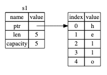
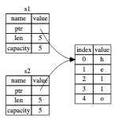
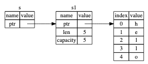
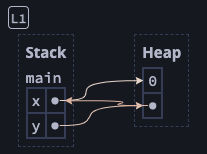

## Ownership

## Chapter Introduction

- A feature “unique” to Rust
- Enables Rust to make memory safety guarantees without needing a garbage collector
- This chapters includes the following concepts
    - borrowing
    - slices
    - how Rust lays data in memory

## What is Ownership

- A set of rules that govern how a Rust program manages memory
- Some languages have a garbage collector that regularly looks for no-longer-used memory as the program runs
- In some others, the programmer must explicitly allocate and free memory
- In Rust, memory is managed through a system of ownership with a set of rules that the compiler checks, none of which will cause the program to slow down during run time.
- **A foundational goal of Rust is to ensure that your programs never have undefined behavior.**

### Stack vs Heap

- Both are parts of memory available to your code to use at runtime but structured differently
- Stack
    - stores the values in the order it gets them and removes the values in the reverse order ⇒ **last in, first out**
    - Adding data to a stack is termed **pushing** and removing data from a stack is called **popping**
    - All data stored on the stack must have a **known, fixed size**
    - Pushing is faster because the location is always the top of the stack
    - Values passed into a function call (including pointers to data on the heap) are stored here and popped off when the function is over.
- Heap
    - Less organized
    - When you store data on a heap, you request a certain amount of space in memory
    - The memory allocator finds an empty spot in the heap that is big enough, marks it as being in use, and returns a **pointer** to the location in memory ⇒ this process is called `allocating`
    - The pointer itself has a known size and is, therefore, stored on the stack
    - To get the actual data, you need to follow the pointer: `pointer` → `actual data in memory`
    - Allocating is slow because the allocator has to find the slot in memory that fits
    - The primary purpose of `ownership` is to manage data on the heap efficiently:
        - keeping track of what parts of code are using what data on the heap
        - minimizing the amount of duplicate data on the heap
        - cleaning up unused data on the heap so that you don’t run out of space

### Quiz

- Which of the following best describes the difference between the stack and the heap?
    
    The stack holds data associated with a specific function, while the heap holds data that can outlive a function
    
    Context: Frames in the stack are associated with a specific function, and are deallocated when the function returns. Data on the heap can live indefinitely. Note that both stack and heap data can be mutable and can be copyable. The heap is allowed to contain pointers (even to the stack, as we will see later).
    
- Consider the execution of the following snippet:
    
    ```rust
    fn main() {
    	let a = Box::new(15); // Box construct allocates on the heap
    	let b = a;
    	let c = Box::new(15);
    }
    ```
    
    In the final state, how many copies of the number 15 live anywhere in the memory?
    
- Consider the execution of the following snippet, with an intermediate state shown:
    
    ```rust
    let mut a = Box::new([0, 1, 2, 3, 4, 5]);
    let mut b = a;
    b[0] = 6;
    ```
    
    In the final state of the snippet, what is the value of `a[0]`? Write you answer as a digit, e.g., 0 or 1.
    
    6
    

### Ownership Rules

1. Each value in Rust has an **owner**.
2. They can only be **one owner** at a time.
3. When the owner goes out of scope, the value will be dropped.

### Variable Scope

- A variable is valid within the scope where it is declared:
    
    ```rust
    { 
    	let s = "hello";
    	
    	// do stuff with s
    }
    ```
    
- In the above program, `s` is valid after it is declared and before the `}` where the scope in which it is defined finishes.

### Ownership Example: the `String` Type

- The `String` type will be used to demonstrate the above concepts of `ownership`.
- A `String` is a dynamic (`heap`) allocated data type in Rust as opposed to the string literal (`str`)
- We can create a `String` from string literal with:
    
    ```rust
    let s = String::from("hello");
    ```
    
- We can mutate this type of string with `mut`:
    
    ```rust
    let mut s = String::from("hello");
    s.push_str(", world");
    
    println!("{}", s);
    ```
    

#### Memory and Allocation

- String literal:
    - In cases where we know the contents of a string at compile-time, we can hardcode the text into our program and thus, the final executable.
    - This makes it fast and efficient but is a result of its immutability
- There are cases where we do not know beforehand the size of a piece of text (string) at compile time.
- This is what the `String` type supports but to enable this (i.e, a growable pice of text), we need to allocate an amount of memory on the heap, unknown at compile time, to hold the contents
- So:
    1. memory has to be requested from the memory allocator at run time
    2. we need a way to return this memory to the allocator when we’re done with our `String`.
- The first part is done by us: when we call the `String::from` function
- The second part is where Rust comes in:
    - In languages with a garbage collector (GC), the GC keeps track of and cleans up memory that isn’t being used anymore and the programmer does not have to think about it.
    - In languages without a GC, it falls on the programmer to manually free the memory that is not being used.
        - If we forget to do it, we’ll “leak” (waste) memory
        - If we do it too early, we’ll have an invalid variable
        - If we do it twice, we’ll be freeing something that has already been freed (which is also a bug)
    - We need to pair one call to `allocate` with exactly one call to `free`.
- In Rust, the memory is deallocated automatically once the variable that owns it goes out of scope
- In the above example, the memory allocated for `s` gets deallocated once `s` goes out of scope automatically.
- Rust calls a special function called `drop` that is responsible for freeing up the allocated memory.
- This pattern of deallocating resources at the end of an item’s lifetime is borrowed from C++, and is called **Resource Acquisition Is Initialization** (RAII).

#### Variables and Data Interacting with Move

- Multiple variables can interact with the same data in different ways:
    
    ```rust
    let x = 5;
    let y = x;
    ```
    
- Here, both `x` and `y` hold a copy of the value `5`. Since this is a primitive with known size, the data are allocated on the stack and popped off when required.
- For the string version:
    
    ```rust
    let s1 = String::from("hello");
    let s2 = s1;
    ```
    
- This looks similar but is actually quite a bit different.
- When we initialize `s1` what we actually get is a `pointer` to a location in memory that holds the actual data: `hello`:



The pointer holds the actual location of the data, the length of the data (in bytes) and the capacity (number of bytes received from the allocator)

- When we bind `s1` to `s2` on the second line, a new pointer `s2` is created that also references the same block of memory in the heap as `s1`.



A new pointer and no new data is created

- If this worked as in the case of primitives, we would also be creating a new chunk of memory on the heap and a new pointer to it.
- As both `s1` and `s2` point to the same piece of memory, when they go out of scope, we’d be tempted to free both of them but because they both point to the same piece of memory on the heap, this leads to memory corruption and potential security vulnerabilities.
- To ensure memory safety, after the line `let s2 = s1;`, Rust considers the variable `s1` no longer valid.
- To demonstrate this, we can run the program:
    
    ```rust
    let s1 = String::from("hello");
    let s2 = s1;
    println!("The original string: {}", s1);
    println!("The new string: {}", s2);
    ```
    
    When trying to run with `cargo run`, we get:
    
    ```rust
    ╰─λ cargo run     
       Compiling demo v0.1.0 (~/rust-book-brown-notes/demo)
    error[E0382]: borrow of moved value: `s1`
     --> src/main.rs:4:41
      |
    2 |     let s1 = String::from("hello");
      |         -- move occurs because `s1` has type `String`, which does not implement the `Copy` trait
    3 |     let s2 = s1;
      |              -- value moved here
    4 |     println!("The original string: {}", s1);
      |                                         ^^ value borrowed here after move
      |
      = note: this error originates in the macro `$crate::format_args_nl` which comes from the expansion of the macro `println` (in Nightly builds, run with -Z macro-backtrace for more info)
    help: consider cloning the value if the performance cost is acceptable
      |
    3 |     let s2 = s1.clone();
      |                ++++++++
    
    For more information about this error, try `rustc --explain E0382`.
    error: could not compile `demo` (bin "demo") due to previous error
    ```
    
- Let’s unpack the error message:
    - The compiler complains that we are trying to reference the `s1` in our `println!` call after is has `move`d.
    - As we are invalidating the original pointer to the string with `let s2 = s1` and creating a new pointer at the same time, Rust terms this process a `move` (rather than a *shallow copy* as in some other languages)
    - If we do want a deep copy (which involves creating a copy of the memory allocated on the heap and thus, performance issues), the compiler suggests that we use the `clone()` method on the `s1` `String`.
- In the case where we are using primitive types, a `Copy` occurs instead of `move`. This is because these data are created on the stack and are thus, cheap to copy
- Rust has a special annotation called the `Copy` trait that we can place on types that are stored on the stack. Data types that implement this trait are (deep-)copied instead of being moved.
- Rust also won’t let us define a `Copy` on a type if the type (or any of its parts) has implemented the `Drop` trait (that is invoked for a heap-allocated dynamic data type and called when a variable it is bound to goes out of scope)
- The `Copy` is trait is implemented by:
    - All integer types
    - The Boolean type
    - All the floating -point types
    - The character type `char`
    - Tuples, if they only contain types that also implement `Copy`. For example, `(i32, i32)` implements `Copy`, but not `(i32, String)`.

#### Ownership and Functions

- Passing a variable to a function will **move** or **copy** just as assignment does.
- Consider the following:
    
    ```rust
    fn main() {
    		let some_string = String::from("world");
        takes_ownership(some_string);
        println!("some string in callee: {}", some_string);
    }
    
    fn takes_ownership(some_string: String) {
        println!("Taking ownership of {}", some_string);
    } // Drop is called here
    ```
    
    When running this, we get:
    
    ```rust
    ╰─λ cargo run
       Compiling demo v0.1.0 (~/rust-book-brown-notes/demo)
    error[E0382]: borrow of moved value: `some_string`
      --> src/main.rs:23:43
       |
    21 |     let some_string = String::from("world");
       |         ----------- move occurs because `some_string` has type `String`, which does not implement the `Copy` trait
    22 |     takes_ownership(some_string);
       |                     ----------- value moved here
    23 |     println!("some string in callee: {}", some_string);
       |                                           ^^^^^^^^^^^ value borrowed here after move
       |
    note: consider changing this parameter type in function `takes_ownership` to borrow instead if owning the value isn't necessary
      --> src/main.rs:26:33
       |
    26 | fn takes_ownership(some_string: String) {
       |    ---------------              ^^^^^^ this parameter takes ownership of the value
       |    |
       |    in this function
       = note: this error originates in the macro `$crate::format_args_nl` which comes from the expansion of the macro `println` (in Nightly builds, run with -Z macro-backtrace for more info)
    help: consider cloning the value if the performance cost is acceptable
       |
    22 |     takes_ownership(some_string.clone());
       |                                ++++++++
    
    For more information about this error, try `rustc --explain E0382`.
    error: could not compile `demo` (bin "demo") due to previous error
    ```
    
    To get around this issue, we need to explicitly return which transfers the ownership to the callee:
    
    ```rust
    fn main() {
    		let another_string: String = String::from("hello, world");
        let another_string: String = takes_and_gives_back(another_string);
        // okay:
        println!("another_string that was returned = {}", another_string);
    }
    
    fn takes_and_gives_back(another_string: String) -> String {
        println!("Taking ownership of '{another_string}' and giving it back");
        another_string
    } // Drop is not called since ownership has been moved
    ```
    
- This process can become annoying because now, if we want to perform some calculation on a data via a function AND use it again in the callee, we have to return the ownership as well. For example:
    
    ```rust
    fn main() {
    		//? Compute and Return
        let yet_another_string: String = String::from("hello, again");
        let (yet_another_string, len) = calculate_length(yet_another_string);
        println!("The length of '{yet_another_string}' is {len}");
    }
    
    fn calculate_length(yet_another_string: String) -> (String, usize) {
        let length = yet_another_string.len();
        (yet_another_string, length)
    }
    ```
    
    Here, if we want to print `yet_another_string` in `main()`, we cannot just return the result of the computation (`length`). So, we resort to tuples here. But there is a better way via `references`.
    

#### Quiz

- Which of the following is NOT a kind of undefined behavior?
    
    Having a pointer to freed memory in a stack frame
    
- Determine whether the program will pass the compiler. If it passes, write the expected output of the program if it were executed.
    
    ```rust
    fn add_suffix(mut s: String) -> String {
      s.push_str(" world");
      s
    }
    fn main() {
      let s = String::from("hello");
      let s2 = add_suffix(s);
      println!("{}", s2);
    }
    ```
    
    DOES compile with `hello world` as the output
    
- Determine whether the program will pass the compiler. If it passes, write the expected output of the program if it were executed.
    
    ```rust
    fn main() {
      let s = String::from("hello");
      let s2;
      let b = false;
      if b {
        s2 = s;
      }
      println!("{}", s);
    }
    ```
    
    does NOT compile (`s2` is neither typed nor initialized)
    
- Say we have a function that moves a box, like this:
    
    ```rust
    fn move_a_box(b: Box<i32>) {
      // This space intentionally left blank
    }
    ```
    
    Below are four snippets which are rejected by the Rust compiler. Imagine that Rust instead allowed these snippets to compile and run. Select each snippet that would cause undefined behavior, or select "None of the above" is none of these snippets would cause undefined behavior.
    
    Should be All (but solution says the `println!("{}", b)` is not undefined behavior even after moving `b` (`let b2 = b;`)??
    

## References and Borrowing

### References

- Instead of passing a dynamically-allocated values directly (and thus, transferrin ownership), we can pass a reference to the variable using the `**&` operator**.
    
    ```rust
    fn main() {
    		let some_string: String = String::from("hello");
        let length = calculate_length_on_ref(&some_string); // passing a ref
        println!("Length of '{some_string}' is {length}");
    }
    
    fn calculate_length_on_ref(s: &String) -> usize {
        s.len()
    }
    ```
    
- Passing a reference creates a pointer to the pointer to the actual data on the heap:



- Here, `&some_string` gets a reference to `some_string` but does not actually own it. This means that `some_string` is not dropped after the `calculate_length_on_ref` function stops executing.
- Once the function call ends, the parameter `s` itself is dropped but not the underlying data it references.
- The action of creating reference is called `borrowing`.
- The problem with this approach, however, is that when passing a reference this way does not allow mutating the underlying data
- For example, this code fails to compile:
    
    ```rust
    fn main() {
    		let some_string: String = String::from("hello");
        change_ref(&some_string);
        println!("string changed to: {some_string}");
    }
    
    fn change_ref(s: &String) {
        s.push_str(", world");
    }
    ```
    

### Mutable References

- To fix the above code, we need to pass in a mutable reference by using the `&mut` keyword:
    
    ```rust
    fn main() {
    		let mut some_string: String = String::from("hello");
        println!("string before change: {some_string}");
        change_ref(&mut some_string);
        println!("string after change: {some_string}");
    }
    
    fn change_ref(s: &mut String) {
        s.push_str(", world");
    }
    ```
    
- To ensure memory safety, this ability to create mutable references comes with a pretty big restriction:
    
    <aside>
    💡 If you have a mutable reference to a value you can have no other references to that value.
    
    </aside>
    
    For example, the following code fails to compile:
    
    ```rust
    fn main() {
    		let mut s = String::from("hello");
        let ref1 = &mut s;
        let ref2 = &mut s;
    
        println!("{}, {}", ref1, ref2);
    }
    ```
    
    The compiler throws the following error:
    
    ```rust
    ╰─λ cargo run
       Compiling demo v0.1.0 (~/rust-book-brown-notes/demo)
    error[E0499]: cannot borrow `s` as mutable more than once at a time
      --> src/references_and_borrowing.rs:13:16
       |
    12 |     let ref1 = &mut s;
       |                ------ first mutable borrow occurs here
    13 |     let ref2 = &mut s;
       |                ^^^^^^ second mutable borrow occurs here
    14 |
    15 |     println!("{}, {}", ref1, ref2);
       |                        ---- first borrow later used here
    
    For more information about this error, try `rustc --explain E0499`.
    error: could not compile `demo` (bin "demo") due to previous error
    ```
    
- The error message says that the code is invalid because between creating and using a mutable reference (`r1`) that borrows `s`, we created another mutable reference (`r2`) that also borrows `s`.
- This restriction allows for mutation but in a very controlled fashion.
- The benefit is that this restriction can **prevent** **data races at compile time**.
- A data race happens when these three behaviors occur:
    - Two or more pointers access the same data at the same time.
    - At least one of the pointers is being used to write to the data.
    - There’s no mechanism being used to synchronize access to the data.
- These cause undefined behavior and are notoriously difficult to track when they occur at runtime. Rust prevents this problem by refusing to compile code with potential data races.
- We can use curly braces to create a new scope that then allows multiple mutable references:
    
    ```rust
    fn main() {
    		let mut s = String::from("hello");
        {
            let ref1 = &mut s;
            println!("Mutable ref1 = {}", ref1);
        }
        let ref2 = &mut s;
    
        println!("Mutable ref2 = {}", ref2);
    }
    ```
    
- Rust also enforces a rule by which we cannot mix mutable and immutable references:
    
    ```rust
    fn main() {
    		let mut s: String = String::from("hello");
    
        let ref1 = &s;
        let ref2 = &s;
        let ref3 = &mut s;
    
        println!("{}, {}, and {}", ref1, ref2, ref3);
    }
    ```
    
    The above code causes the following compilation error:
    
    ```rust
    Compiling demo v0.1.0 (~/rust-book-brown-notes/demo)
    error[E0502]: cannot borrow `s` as mutable because it is also borrowed as immutable
      --> src/references_and_borrowing.rs:28:16
       |
    26 |     let ref1 = &s;
       |                -- immutable borrow occurs here
    27 |     let ref2 = &s;
    28 |     let ref3 = &mut s;
       |                ^^^^^^ mutable borrow occurs here
    29 |
    30 |     println!("{}, {}, and {}", ref1, ref2, ref3);
       |                                ---- immutable borrow later used here
    
    For more information about this error, try `rustc --explain E0502`.
    error: could not compile `demo` (bin "demo") due to previous error
    ```
    
- The above error basically means that within the scope wherein an immutable reference is used (lines 26 to 30), there cannot be a mutable reference (line 28).
- This is because of users of an immutable reference do not expect the value to suddenly change out from under them!

<aside>
💡 Multiple immutable references are allowed because no one who is just reading the data has the ability to affect anyone else’s reading of the data.

</aside>

- The following code works:
    
    ```rust
    fn main() {
    		let mut s: String = String::from("hello");
    
        let ref1 = &s;
        let ref2 = &s;
        println!("Mutable references: {} and {}", ref1, ref2);
    
        let ref3 = &mut s;
    
        println!("Immutable reference: {}", ref3);
    }
    ```
    

### Dangling References

- A dangling reference is a pointer that references a location in memory that may have been given to someone else by freeing some memory while preserving a pointer to that memory
- Rust guarantees that there will never be dangling pointers by ensuring that the data will not go out of scope before the reference to the data does.
- Let’s try creating a dangling reference:
    
    ```rust
    fn main() {
    	let dangling_ref = dangle();
    }
    
    fn dangle() -> &String {
        let s = String::from("hello");
        &s
    } // s goes out of scope but we are returning a reference to s
    ```
    
    This causes the following error:
    
    ```rust
    error[E0106]: missing lifetime specifier
      --> src/references_and_borrowing.rs:46:16
       |
    46 | fn dangle() -> &String {
       |                ^ expected named lifetime parameter
       |
       = help: this function's return type contains a borrowed value, but there is no value for it to be borrowed from
    help: consider using the `'static` lifetime
       |
    46 | fn dangle() -> &'static String {
       |                 +++++++
    
    For more information about this error, try `rustc --explain E0106`.
    error: could not compile `demo` (bin "demo") due to previous error
    ```
    
- Ignoring for the present any discussion on `lifetime`, the compiler is trying to tell us that we have borrowed from a value that has gone out of scope, which is indeed the case.
- The solution is to return the `String` itself which transfers the ownership and nothing is `drop`'d.

### Dereferences

- Dereferencing a pointer is achieved by the `*` operator.
- Example 1:
    
    ```rust
    let mut x: Box<i32> = Box::new(1); // allocate 1 on the heap
    let a: i32 = *x; // a = 1
    *x += 1; // *x = 2 (a is unchanged)
    ```
    
- In the above:
    - `x` points to a memory in heap that has the value `1`.
    - `a` dereferences `x` so that it now holds the value `x` is pointing to i.e., `1`
    - In the third line, `*x` is the actual value on the heap that is incremented by `1`. So, the value that `x` points to on the heap is now, `2`.
- Example 2:
    
    ```rust
    // r1 holds the address of x (defined above) which itself is an address to a location in the heap
    let r1: &Box<i32> = &x;
    
    let b: i32 = *(*r1); // or simply, **r1: *(*r1) = *(x) = 2
    
    ```
    
- In the above:
    - `r1` contains the address of `x`. `x` in turn is the pointer to an address in heap memory.
    - To get to the actual value, we therefore, need to make two passes:
        - Dereference `r1` to get `x` i.e, the address of the value in the heap that `x` points to. `&x` holds the address of `x` on *the stack*, while the `x` holds the address of the value on *the heap*
        - Dereference `x` to get the actual value on the heap
- Example 3:
    
    ```rust
    let r2: &i32 = &*x; // &(*x) = &(<heap_value>) = address of heap value
    let c: i32 = *r2; // deref address of heap value => value
    ```
    
- In the above:
    - `r2` holds the [address-of (`&`)] of [the-value-in-`x` (`*x`)].
        - the-value-in-x i.e., `*x` is the actual value on the heap
        - the address-of (`&`) this value in the heap just returns a pointer to the location on the heap. This is the same as the value pointed to by `x`. This also means that we have now created a second pointer to the same location on the heap.
- The deference operator isn’t seen that often in Rust code. Rust implicitly inserts dereferences and references in certain cases, such as calling a method with the dot operator. The following lines are equivalent:
    - `i32::abs(*x)` and `x.abs()` where `x = Box::new(-1)`
    - `i32::abs(**r1)` and `r1.abs()` where `x = &x`
    - `str::len(&s)` and `s.len()` where `s = String::from("hello")` (`&s` because `len` expects a reference to the actual value so as not to own it)

### Rules of Reference

- At any given time, you have *either* one mutable reference *or* any number of immutable references.
- References must always be valid.

### Quiz

- Consider the following program, showing the state of memory after the last line:
    
    ```rust
    let x = Box::new(0);
    let y = Box::new(&x);
    ```
    
    If you wanted to copy out the number `0` through `y`, how many dereferences would you need to use? Write your answer as a digit. For example, if the correct expression is `*y`, then the answer is 1.
    
    ⇒ `x` is on the stack and holds the location of `0`. `&x` is the address of `x`. `Box::new(&x)` causes this address to be stored on the heap. So, we need to first dereference `y` to get the value on the heap that contains the address of `x` (on the stack), then we need to dereference this to get the address of the value on the heap and finally dereference that to get the actual value on the heap. So the answer is 3. Diagrammatically, we have the following (where each arrow is a reference that needs dereferencing):
    



- Consider the following program, showing the state of memory after the last line:
    
    ```rust
    fn get_first(vr: &Vec<i32>) -> i32 {
      vr[0]
    }
    
    fn main() {
      let mut v = vec![0, 1, 2];
      let n = get_first(&v);
      println!("{} {}", n, v[1]); 
    }
    ```
    
    Which of the following best explains why `v` is not deallocated after calling `get_first`?
    
    ⇒ `vr` is a reference that does not own the vector it points to
    

### Simultaneous Aliasing and Mutation

- Aliasing means accessing the same underlying data through different variables
- On its own, this is harmless but when combined with mutation, we can get disastrous results mainly through:
    - Deallocating aliased data leaving the other variable to point to deallocated memory.
    - Mutating the aliased data, invalidating runtime properties expected by the other variable
    - Concurrently mutating the aliased data, causing a data race with non-deterministic behavior for the other variable.
- We will take the following running example to illustrate this. Note that `vec!` defines a macro to create a `Vec` (which is just an array that has a variable capacity):
    
    ```rust
    let mut vec: Vec<i32> = vec![1, 2, 3];
    vec.push(4);
    ```
    
    The actual implementation is a bit complicated in that `vec` actually allocates a heap array of a certain *capacity*. When we push to a `Vec`,
    
    - a new allocation with a larger capacity is created,
    - the contents of the original `Vec` are copied over and
    - the original `Vec` is deallocated.
- Let’s now create a reference to a piece of data on a `Vec` before pushing to it:
    
    ```rust
    let num: &i32 = &vec[2]; // ref to a location in the vec
    vec.push(4); // this causes a new underlying array to be allocated and the original to be deallocated
    ```
    
    - A new allocation is invoked by the `push` operation that also deallocates the original `Vec`
    - But `num` is still pointing to a piece of memory on the original one that has now been deallocated.
    - This leads to undefined behavior.
- To avoid these kinds of issues, Rust follows a basic principle:
    
    <aside>
    💡 **Pointer Safety Principle**: data should never be aliased and mutated at the same time
    
    </aside>
    
- Rust enforces this principle for boxes (owned pointers) by disallowing aliasing. Assigning a box from one variable to another will move ownership (invalidating the previous variable). Owned data can only be access through the owner — not aliases
- References, however, are non-owning pointers so they need different rules to ensure Pointer Safety.
- This is accomplished via the `borrow checker`.

### References Change Permissions on Paths

- The core idea behind the `borrow checker` is that variables have three kinds of **permissions** on their data.
    - Read (R): data can be copied to another location
    - Write (W): data can be mutated in-place
    - Own (O): data can be moved or dropped
- These permissions only exist within the compiler and not at runtime, and describe how the compiler “thinks” about your program before the program is executed.
- When we declare a variable with `let`, the variable has `RO` permissions. When we also add `mut`, the variable gets `RWO` permissions
- To illustrate this let’s take the safe version of the above program:
    
    ```rust
    fn main() {
        let mut data: Vec<i32> = vec![1, 2, 3]; // data:RWO
        println!("The vec before pushing an element: {:?}", data);
    
        let num: &i32 = &data[2]; // data:R, num:RO, *num:R
        println!("The third element in the Vec is {}", *num); // data: RWO, num: null, *num: null
    
        data.push(4); 
        println!("The vec after pushing an element: {:?}", data); // data: null
    }
    ```
    
    Here,
    
    - When `data` is initialized with `mut`, it has all permissions
    - When we declare `num`, it borrows the value at index `2` of `data`, and three things happen:
        - Borrow removes `WO` from `data` (it cannot be written to or owned but can still be read)
        - `num` gets `RO` permissions (no `W` because it is not declared with `mut`)
    - After `println!`, the `num` is not used, so `data` regains its permissions and `num` and `*num` lose all of their permissions
    - After the final `println!` operation, `data` is no longer used and so it loses all of its permissions
- Notice that in the above program, we annotate the permissions for both `num` and `*num`. This is because accessing the data through a reference is different than to manipulate the reference itself. For example, in the code below:
    
    ```rust
    let x = 0; // x:RO
    let mut x_ref = &x; // x:R, x_ref:RWO, *x_ref:R
    ```
    
    Notice that `x_ref` has `W` permission i.e, we can assign `x_ref` to a different reference (say, `x_ref = &y`) while `*x_ref` does not which means we cannot mutate the pointed data (say, `*x_ref += 1`).
    
- More generally, permissions are defined on `paths` and not just variables. A path is anything you can put on the left-hand side of an assignment. Paths include:
    - Variables, like `a`
    - Dereferences, like `*a`
    - Array accesses of paths, like `a[0]`
    - Fields of paths, like `a.1` or `a.field`
    - Any combination of the above

### Borrow Checker Finds Permission Violations

- The goal of the above permissions is to ensure the *Pointer Safety Principle* by making sure that data cannot be mutated if it is aliased.
- Creating a reference to a data (i.e, borrowing) causes that data to be temporarily read-only until the reference is no longer used.
- Going back to the unsafe example, let’s annotate the safety checks:
    
    ```rust
    // data has RWO permissions
    let mut data: Vec<i32> = vec![1, 2, 3];
    
    // num borrows data[2], so data has R, num has RO and *num has R
    let num: &i32 = &data[2]; 
    
    // data needs RW permission, but it is currently borrowed by `num`
    // and used in the `println!` below
    // if `data` were allowed to get RW, `*num` will have an undefined behavior
    // so the compiler prevents this
    data.push(4);
    
    println!("Third element is {}", *num);
    ```
    

### Mutable References Provide Unique and Non-Owning Access to Data

- Mutable references allow mutation but prevent aliasing which makes them safe
- In the above example, if we were to use mutable reference to `data` for `num`, we would render `data` in itself unusable within the scope that `num` exists so effectively not an alias!
    
    ```rust
    let num: &mut i32 = &mut vec[2]; // num: RO, *num: RW
    
    // in contrast
    let mut num: &mut i32 = &mut vec[2]; // num: RWO, *num: RW
    ```
    
- We can remove the `W` permission from `num` by taking a reference to it (borrowing):
    
    ```rust
    let num: &mut i32 = &mut vec[2]; // num: RO, *num: RW
    let num2: &i32 = &*num; // num: R, num2: RO, *num: R, *num2: R
    ```
    

### Permissions Are Returned At The End of a Reference’s Lifetime

- A path’s lifetime spans the range of code from its birth (where the reference is created) to its death (the last time(s) the reference is used)
- Example 1:
    
    ```rust
    let mut x = 1;
    
    // lifetime of y begins:
    let y = &x; // x: R, y: RO, *y: R
    
    // lifetime of y ends and returns the permissions of x
    // not that this would not have happened if we instead did z = y;
    // z = y would have transferred ownership to z and not returned
    let z = *y; // x: RWO, y: nil, *y: nil, z: RO
    
    x += z
    ```
    
- Example 2:
    
    ```rust
    // the fn takes a non-owning, mutable ref to `v`
    // v: RO, *v: RW
    fn ascii_capitalize(v: &mut Vec<char>) {
        // c borrows v[0], making v immutable and taking ownership
        let c = &v[0]; // v: R, *v: R, c:RO
    
        if c.is_ascii_lowercase() {
            // after this call, c's lifetime ends releasing the ownership to `v`
            // v: R), *v: RW, up: RO
            let up = c.to_ascii_uppercase();
    
            // at this point, we can mutate *v
            v[0] = up; // this is the same as (*v)[0]
        } else {
            println!("Already capitalized: {:?}", v);
        }
    }
    ```
    

### Quiz

- Consider the permissions in the following program:
    
    ```rust
    fn main() {
    	let mut s = String::from("Hello"); // s: RWO
    	let t = &mut s; // t: RO, *t: RW, s: no permissions
    	/* here */ // no permissions
    	t.push_str(" world");
    	println!("{}", s);
    }
    ```
    
    At the point marked `/* here */`, what are the permissions on the path `s`? Select each permission below, or select "no permissions" if the path has no permissions.
    
    ⇒ no permissions
    
- Consider the permissions in the following program:
    
    ```rust
    fn get_first(v: &Vec<String>) -> &str {
        &v[0]
    }
    
    fn main() {
        let mut strs = vec![
            String::from("A"), String::from("B")
        ]; // strs: RWO
        let first = get_first(&strs); // strs: no permissions
        if first.len() > 0 {
            strs.push(String::from("C"));
        }
    }
    ```
    
    Which of the following best explains why `strs` loses and regains write permissions?
    
    ⇒ `get_first` returns an immutable reference to data within `strs`, so `strs` is not writable while `first` is live
    
- Consider this unsafe program
    
    ```rust
    fn main() {
    	let v1 = vec![1, 2, 3]; //v1: RWO
    	let mut v2 = v1; // v2: RWO, v1: no permissions
    	v2.push(4); // v2: RWO (after reclaim)k, v1: no permissions
    	println!("{}", v1[0]); // invalid ref
    }
    ```
    
    Which of the following best describes the point at which undefined behavior occurs in this program?
    
    `v1[0]` reads `v1`, which points to deallocated memory
    

### Data Must Outlive All Of Its References

- Rust enforces this property in two ways
- Consider the following example:
    
    ```rust
    		let s = String::from("hello");
        let s_ref = &s; // s_ref borrows from s
    
        drop(s); // `drop` expects O but ownership is with s_ref
        println!("{}", s_ref);
    ```
    
- Here, Rust knows how long `s_ref` lives but Rust needs a different enforcement mechanism when it doesn’t know how long a reference lives, specifically when references are either input to a function, or output from a function.
- For example, here is a safe function:
    
    ```rust
    fn first(strings: &Vec<String>) -> &String {
        let s_ref = &strings[0]; // strings[0]: RF
        return s_ref; // s_ref: RF
    }
    ```
    
    Here, `s_ref` has a `Flow` permission indicating its ability to flow into a particular expression. This permission is expected whenever an expression uses an input reference (like `*strings[0]`) or returns an output reference (like `return s_ref`).
    
    Unlike the RWO permissions, F does not change throughout the body of a function.
    
- For example, consider the following program that does not compile:
    
    ```rust
    fn main() {
    		//? flow permission
        let strings = vec![];
        let default = String::from("hello");
        let s = first_or(&strings, &default);
        drop(default);
        println!("{}", s);
    }
    
    fn first_or(strings: &Vec<String>, default: &String) -> &String {
        if strings.len() > 0 {
            &strings[0]
        } else {
            default
        }
    }
    ```
    
    The compiler says:
    
    ```rust
    error[E0106]: missing lifetime specifier
      --> src/borrow_checker.rs:48:57
       |
    48 | fn first_or(strings: &Vec<String>, default: &String) -> &String {
       |                      ------------           -------     ^ expected named lifetime parameter
       |
       = help: this function's return type contains a borrowed value, but the signature does not say whether it is borrowed from `strings` or `default`
    help: consider introducing a named lifetime parameter
       |
    48 | fn first_or<'a>(strings: &'a Vec<String>, default: &'a String) -> &'a String {
       |            ++++           ++                        ++             ++
    ```
    
    The error message tells us that the return value is a borrowed reference but there is no way for the compiler to tell whether the reference is to the first parameter or the second.
    
- To solve this issue, we need lifetime annotations which will be covered much later.
- Here, is a simpler example program that also fails:
    
    ```rust
    fn return_a_string() -> &String {
        let s = String::from("Hello world");
        let s_ref = &s;
        s_ref // s is on the stack and is invalidated the moment the function returns
    }
    ```
    

### Quiz

- Skipping quiz as it adds to the confusion

### Fixing Ownership Errors

- What do you do when the borrow checker rejects your code?

#### Case I: Returning a Reference to the Stack

```rust
fn return_a_string() -> &String {
    let s = String::from("Hello world");
    &s
}
```

Here, `&s` is a reference to the stack variable `s` that is deallocated the moment the function returns. An easy fix is to just return `s`

#### Case II: Not Enough Permissions

```rust
fn stringify_name_with_title(name: &Vec<String>) -> String {
    name.push(String::from("Esq."));
    let full = name.join(" ");
    full
}

// ideally: ["Ferris", "Jr."] => "Ferris Jr. Esq."
```

- Here, to `push` to the `name` variable, we need the ref to be mutable `&mut Vec<String>`
- While we can pass a mutable reference, it is a bad design choice for this particular case given the name and intent of the function i.e, a function that is supposed to return a string that joins strings in a vector is not expected to mutate the vector
- The better solution, therefore, is to clone the vector and mutate the clone.

#### Quiz

- Which of the following is NOT a valid kind of fix to the issue of returning a stack reference from a function?
    
    Extend the lifetime of the stack frame
    
- Let's say a programmer tried writing the following function:
    
    ```rust
    /// Returns a person's name with "Ph.D." added as a title
    fn award_phd(name: &String) -> String {
        let mut name = *name;
        name.push_str(", Ph.D.");
        name
    }
    ```
    
    Given the stated purpose of the function, which of the following would be the most idiomatic fix to the program? 
    
    ```rust
    fn award_phd(name: &String) -> String {
        let mut name = name.clone();
        name.push_str(", Ph.D.");
        name
    }
    ```
    
- Let's say a programmer tried writing the following function:
    
    ```rust
    /// Rounds all the floats in a vector to the nearest integer, in-place
    fn round_in_place(v: &Vec<f32>) {
        for n in v {
            *n = n.round();
        }
    }
    ```
    
    Given the stated purpose of the function, which of the following would be the most idiomatic fix to the program? The differences from the function above are highlighted.
    
    ```rust
    fn round_in_place(v: &mut Vec<f32>) {
        for n in v {
            *n = n.round();
        }
    }
    ```
    

*skipping Case III because contains a lot of new syntax with iterators, will return later*

#### Case IV: Copying vs Moving Out of a Collection

- Here is a safe code:
    
    ```rust
    fn main() {
    	let v: Vec<i32> = vec![0, 1, 2];
    	let n_ref: &i32 = &v[0]; // copies a number out of a vector
    	let n: i32 = *n_ref;
    }
    ```
    
- Here is an unsafe code:
    
    ```rust
    fn main() {
    	let v: Vec<String> = 
    	  vec![String::from("Hello world")];
    	let s_ref: &String = &v[0]; // borrows v[0] (no Copy trait)
    	let s: String = *s_ref; // cannot move out of shared reference
    }
    ```
    
- The error that the compiler throws is:
    
    ```rust
    error[E0507]: cannot move out of `*s_ref` which is behind a shared reference
      --> src/borrow_checker.rs:25:21
       |
    25 |     let s: String = *s_ref; // cannot move out of shared reference
       |                     ^^^^^^ move occurs because `*s_ref` has type `String`, which does not implement the `Copy` trait
       |
    help: consider removing the dereference here
       |
    25 -     let s: String = *s_ref; // cannot move out of shared reference
    25 +     let s: String = s_ref; // cannot move out of shared reference
       |
    ```
    
- The issue is that the vector `v` owns the string `"Hello, world"`. When we dereference `s_ref`, it tries to take the ownership form the vector `v`.
- But references are non-owning pointers — we can’t take ownership through a reference (`s_ref`).
- Rust prevents this because if allowed to happen, both `s` and `v` would point to the same location on the heap and when drop is invoked on these, we would encounter a **double-free**!
- To fix this issue, we can either not use a dereference or clone or just `remove` the string from the vector

#### Case V: Mutating Different Tuple Fields (Rejected Safe Program)

```rust
fn get_first(name: &(String, String)) -> &String {
    &name.0
}

fn main() {
    let mut name = (
        String::from("Ferris"), 
        String::from("Rustacean")
    );
    let first = get_first(&name);
    name.1.push_str(", Esq.");
    println!("{first} {}", name.1);
}
```

This program causes the following error:

```rust
error[E0502]: cannot borrow `name.1` as mutable because it is also borrowed as immutable
  --> test.rs:11:5
   |
10 |     let first = get_first(&name);
   |                           ----- immutable borrow occurs here
11 |     name.1.push_str(", Esq.");
   |     ^^^^^^^^^^^^^^^^^^^^^^^^^ mutable borrow occurs here
12 |     println!("{first} {}", name.1);
   |                ----- immutable borrow later used here
```

Here, although the function just uses `name.0` and not `name.1`, Rust does not allow us to mutate `name.1` in our main program because it only looks at the function signature and not the underlying implementation. The signature just says some reference to a string is returned and Rust decides conservatively that any of the strings in the tuple could have been borrowed.

A solution is to move the implementation inside the function out to the main function or to use [cells](https://doc.rust-lang.org/std/cell/index.html).

#### Case VI: Mutating Different Array Elements

```rust
fn main() {
	let mut a = [0, 1, 2, 3];
	let x = &mut a[0]; // mutable borrow occurs here
	*x += 1;
	println!("{a:?}");
}
```

Rust’s borrow checker does not contain separate paths for each index of the array `a`. Instead, it uses a single path `a[_]` that represents *all* indices of `a`. It does this because it cannot always determine the value of an index.

To solve this issue, we can either use `slice::split_first_mut` or directly use an `unsafe` block:

```rust
let mut a = [0, 1, 2, 3];
let x = &mut a[0] as *mut i32;
let y = &a[1] as *const i32;
unsafe { *x += *y; } // DO NOT DO THIS unless you know what you're doing!
```

#### Quiz

- Which of the following best explains why an `i32` can be copied without a move, but a `String` cannot?
    
    ⇒ A `String` owns data on the heap, while an `i32` does not
    
- The following code snippet does not compile:
    
    ```rust
    let s = String::from("Hello world");
    let s_ref = &s;
    let s2 = *s_ref;
    println!("{s2}");
    ```
    
    ⇒ The string is freed twice at the end of the program
    
- The following program does not compile:
    
    ```rust
    fn pass_along(v: &mut Vec<i32>, i: usize) {
      let n = &mut v[i];
      *n = v[i - 1];
    }
    fn main() {
      let mut v = vec![1, 2, 3];
      pass_along(&mut v, 1);
    }
    ```
    
    ⇒ There is no undefined behavior in this program
    
    Context: This program is safe. No undefined behavior could occur if it were executed. (If `i` was outside the bounds of `v`, then Rust will panic at runtime rather than cause undefined behavior.) The issue is that Rust doesn't know for sure that `v[i]` and `v[i - 1]` are referring to different elements.
    
- Consider this function that is a simplified variant of the function from the previous quiz:
    
    ```rust
    /// Adds "Ph.D." to a person's name
    fn award_phd(name: &String) {
        let mut name = *name;
        name.push_str(", Ph.D.");
    }
    ```
    
    Assume that the compiler did NOT reject this function. Select each (if any) of the following programs that could possibly cause undefined behavior if executed. If none of these programs could cause undefined behavior, then check "None of these programs" .
    
    ```rust
    // does NOT compile
    let name = String::from("Ferris");
    award_phd(&name);
    
    // does NOT compile
    let name = String::from("Ferris");
    award_phd(&name);
    println!("{}", name);
    
    // does NOT compile
    let name = String::from("Ferris");
    let name_ref = &name;
    award_phd(&name);
    println!("{}", name_ref);
    ```
    
- Determine whether the program will pass the compiler. If it passes, write the expected output of the program if it were executed.
    
    ```rust
    fn main() {
        let mut point = [0, 1];
        let mut x = point[0];
        let y = &mut point[1];
        x += 1;
        *y += 1;
        println!("{} {}", point[0], point[1]);
    }
    ```
    
    The program **does** compile with the output: `0 2`
    
    Context: This program does compile, as the binding of `x` copies `point[0]`, allowing `y` to mutably borrow `point[1]`. The mutation `x += 1` does not affect `point`, while the mutation `*y += 1` does, so the final result is `0 2`.
    

## Slices

### Introduction

- Slices let you reference a contiguous sequence of elements in a collection rather than the whole collection.
- It is a kind of reference and so does not have ownership of the data it references.
- Let’s consider the following example program that returns the first word in a string by taking a slice of a string from the beginning to the first occurrence of a space. If no space is found, the slice holds the entire string (one word).
    
    We do not want ownership of the string, so we pass in a reference to it. To get the first word, we cannot create new string or we can just return the index of the first space. We will take the latter approach to demonstrate the concept of slices:
    
    ```rust
    fn main() {
        let s: String = String::from("hello, world");
        let word = first_word(&s);
        println!("Index to the first space is {word}");
    }
    
    fn first_word(s: &String) -> usize {
        let bytes = s.as_bytes();
    
        for (i, &item) in bytes.iter().enumerate() {
            if item == b' ' {
                return i;
            }
        }
    
        bytes.len()
    }
    ```
    
- Let’s go over the above program:
    - We need to go through each character in the string, so we first convert it to bytes:
        
        ```rust
        let bytes = s.as_bytes();
        ```
        
    - We then need to iterate through this array of bytes:
        
        ```rust
        bytes.iter() // this returns an iterator
        ```
        
        Since we need to check the character and returns its index if it is a space, we need to call `enumerate()` on this iterator that returns a tuple of `index` and `&value` (ref to value) on the iterator (array).
        
    - Inside the loop, we return the index if the character at that index is a space.
    - If the loop ends without finding any space, then the whole string is a single word, so we return the length of the string.
- The problem with this approach is that we are returning a `usize`, the index to the first space on its own. In other words, this value only makes sense in the context of the string that is passed to the function.
- Outside this function, since the value is entirely separate from the underlying `String`, it can become meaningless if the `String` changes.
- To illustrate this, consider the following program:
    
    ```rust
    fn main() {
        let mut s: String = String::from("hello, world");
        let word = first_word(&s);
        s.clear();
        println!("Index to the first space is {word}");
    }
    ```
    
    The above program compiles even though the value of `word` becomes meaningless after `clear`-ing the `String` `s`.
    
- This means that in order to preserve meaning, we need to track the relationship between the word and the index, which is a tedious task.
- The solution that Rust provides is `String Slices`

### String Slice

- It is a reference to a part of the string:
    
    ```rust
    fn main() {
    		let s = String::from("hello, world");
        let hello = &s[0..5];
        let world = &s[7..12]; // pointer to byte index 7 of `s` with length 5
    
    		println!("first word = {hello}, second word = {world}")
    }
    ```
    
- This syntax leverages Rust’s `..` range syntax. With this:
    - if you want to start from the beginning you can omit the starting index:
        
        `&s[0..5]` and `&s[..5]` are equivalent
        
    - if you want till the end of the string, you can omit the ending index:
        
        `&s[7..s.len()]` and `&s[7..]` are equivalent
        
    - if you want the entire string, we can drop both indices:
        
        `&s[0..s.len()]` and `&s[..]` are equivalent
        
- The string slices must occur at valid UTF-8 character boundaries. There are multi-byte characters in UTF-8 and slicing them in the middle is not allowed.
- Now, we can modify the `first_word` function as follows:
    
    ```rust
    fn first_word_slice(s: &String) -> &str {
        let bytes = s.as_bytes();
    
        for (i, &item) in bytes.iter().enumerate() {
            if item == b' ' {
                return &s[..i];
            }
        }
    
        &s[..]
    }
    ```
    
- As we are now referencing the underlying string itself, the compiler makes it much harder for us to mess up. For example, we can clear the string as before but it leads to a compilation error:
    
    ```rust
    fn main() {
    		let s: String = String::from("hello, world");
        let first_word_slice = first_word_as_slice(&s);
        s.clear();
        println!("The first word is: {first_word_slice}");
    }
    ```
    
    This results in the following error:
    
    ```rust
    error[E0502]: cannot borrow `s` as mutable because it is also borrowed as immutable
      --> src/slices.rs:15:5
       |
    14 |     let first_word_slice = first_word_as_slice(&s);
       |                                                -- immutable borrow occurs here
    15 |     s.clear();
       |     ^^^^^^^^^ mutable borrow occurs here
    16 |     println!("The first word is: {first_word_slice}");
       |                                  ------------------ immutable borrow later used here
    
    For more information about this error, try `rustc --explain E0502`.
    error: could not compile `demo` (bin "demo") due to previous error
    ```
    
- The above error tells us that we are mixing mutable and immutable reference. Here, `clear()` needs to modify the string, so it receives a mutable reference. But we are using an immutable reference to `s` when we print it.
- This eliminates the semantic errors that we previously encountered.

### String Slices as Parameters

- We can also use string slices as function parameters:
    
    ```rust
    fn first_word_from_slice(s: &str) -> &str {
    		... // same as before
    }
    ```
    
- In fact, using `&str` as the parameter type in `first_word` is preferred over `&String` as it allows maximum flexibility:
    - We can pass in a `String` reference or reference to its slice:
        
        ```rust
        let s = String::from("hello world");
        println!("First word = {}", first_word_from_slice(&s));
        println!("First word = {}", first_word_from_slice(&s[..]));
        println!("First word = {}", first_word_from_slice(&s[0..7]));
        ```
        
    - We can pass in a string literal or slice to the string literal:
        
        ```rust
        let s_literal = "hello world";
        println!("First word = {}", first_word_from_slice(&s));
        println!("First word = {}", first_word_from_slice(&s[..]));
        println!("First word = {}", first_word_from_slice(&s[0..7]));
        ```
        

### Other Slices

- String slices work on strings, as expected.
- But we can take slices from arrays of any other types as well:
    
    ```rust
    let non_str: &[i32; 5] = [1, 2, 3, 4, 5];
    let slice: &[i32] = &non_str[1..3]; // slice beginning at index 1 with length (3-1)=2
    assert_eq!(slice, &[2, 3]);
    ```
    

### Quiz

- Consider the variables `s2` and `s3` in the following program. These two variables will be located in memory within the stack frame for `main`. Each variable has a size in memory on the stack, *not* including the size of pointed data. Which statement is true about the sizes of `s2` and `s3`?
    
    ```rust
    fn main() {
      let s = String::from("hello");
      let s2: &String = &s;
      let s3: &str = &s[..];
    }
    ```
    
    `s3` has more bytes than `s2`!
    
    **Context**: The type `&String` is a normal reference consisting of a single pointer, so 8 bytes on a 64-bit architecture. The type `&str` is a special slice reference which consists of a pointer *and* a length, so 16 bytes. Therefore `s3` of type `&str` uses more memory than `s2` of type `&String`. You can verify this yourself using `[std::mem::size_of](https://doc.rust-lang.org/std/mem/fn.size_of.html)`, like so:
    
    ```rust
    fn main() {
      println!(
        "&String={} &str={}",
        std::mem::size_of::<&String>(),
        std::mem::size_of::<&str>(),
      );
    }
    ```
    
    Also, note that Rust will implicitly convert string references to either `&String` or `&str` based on the context of the reference. So the expression `&s` produces two different values based on the expected type of `&s`.
    
- Determine whether the program will pass the compiler. If it passes, write the expected output of the program if it were executed.
    
    ```rust
    fn main() {
      let mut s = String::from("hello");
      for &item in s.as_bytes().iter() {
        if item == b'l' {
          s.push_str(" world");
        }
      }
      println!("{s}");
    }
    ```
    
    **Context**: Because `s.as_bytes()` produces an immutable reference to `s`, it is illegal to mutate `s` (via `push_str`) inside the for-loop.
    

## Final Recap Quiz

- Say you are writing a function with the following spec:
    
    `round_all` takes as input a list of floating point numbers, and it rounds each number in-place to the nearest integer.
    
    Which of the following is the most appropriate type signature for a function implementing this spec?
    
    Ans:
    
    ```rust
    fn round_all(v: &mut Vec<f32>);
    ```
    
- Say you are writing a function with the following spec:
    
    `find_contains` takes as input a collection of strings and a target substring. It returns a list of all the strings in the collection that contain the target substring.
    
    Which of the following is the most appropriate type signature for a function implementing this spec?
    
    Ans:
    
    ```rust
    fn find_contains(haystack: &[String], needle: &str) -> Vec<&String>;
    ```
    
    **Context**: For `haystack`, the slice type `&[String]` can accept more inputs than `&Vec<String>`, so it is preferred. For `needle`, the target substring does not need to be heap-allocated, so `&str` is preferred to `String`. For the return type, `Vec<String>` is not desirable because it would require cloning the input strings. `&[String]` is not desirable because it can only return a contiguous subsequence of the input. `Vec<&String>` is the most preferable because it only incurs the cost of allocating the vector, not the strings themselves.
    
- Rust normally disallows multiple mutable accesses to the same array, even when those accesses are disjoint. For example, this function does not compile:
    
    ```rust
    fn main() {
      let mut v = vec![0, 1, 2, 3];
      let (r0, r1) = (&mut v[0..2], &mut v[2..4]);
      r0[0] += 1;
      r1[0] += 1;  
    }
    ```
    
    However, the Rust standard library has a function `slice::split_at_mut` that does permit this functionality:
    
    ```rust
    fn main() {
      let mut v = vec![0, 1, 2, 3];
      let (r0, r1) = v.split_at_mut(2);
      r0[0] += 1;
      r1[0] += 1;  
    }
    ```
    
    Which of the following best describes how it's possible to implement `split_at_mut`?
    
    ⇒ `split_at_mut` uses unsafe code to circumvent the borrow checker with raw pointers
    
- Consider the permissions in the following program:
    
    ```rust
    fn main() {
    	let s = String::new();
    	let s_ref = &s;
    	println!("{s_ref}");
    }
    ```
    
    Which of the following best explains why `*s_ref` does not have the **O** (own) permission?
    
    ⇒ Ownership permits moving, and moving out of a reference can cause a double-free
    
- Consider the set of Rust programs that contain no `unsafe` code. Select each of the following statements that is true about the kinds of programs accepted and rejected by the borrow checker:
    
    Ans:
    
    - The borrow checker always rejects programs with undefined behavior
    - The borrow checker sometimes rejects programs without undefined behavior
- The function `extract` is rejected by the borrow checker:
    
    ```rust
    fn extract(b: &Box<i32>) -> i32 {
        let b2: Box<i32> = *b;
        *b2
    }
    ```
    
    Imagine that the borrow checker did not reject this function. Determine whether there exists an input such that the function would cause undefined behavior if executed on that input.
    
    ⇒ This function COULD cause undefined behavior
    
- The function `transfer_string` is rejected by the borrow checker:
    
    ```rust
    fn get_first(strs: &mut (String, String)) -> &mut String {
        &mut strs.0
    }
    fn get_second(strs: &mut (String, String)) -> &mut String {
        &mut strs.1
    }
    fn transfer_string(strs: &mut (String, String)) {
        let fst = get_first(strs);
        let snd = get_second(strs);
        fst.push_str(snd);
        snd.clear();
    }
    ```
    
    Imagine that the borrow checker did not reject this function. Determine whether there exists an input such that the function would cause undefined behavior if executed on that input.
    
    ⇒ This function could NOT cause undefined behavior
