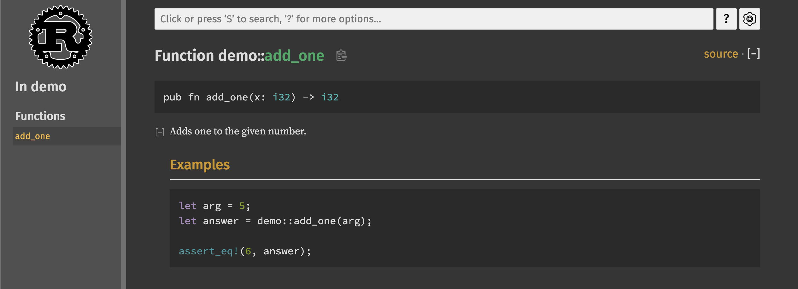
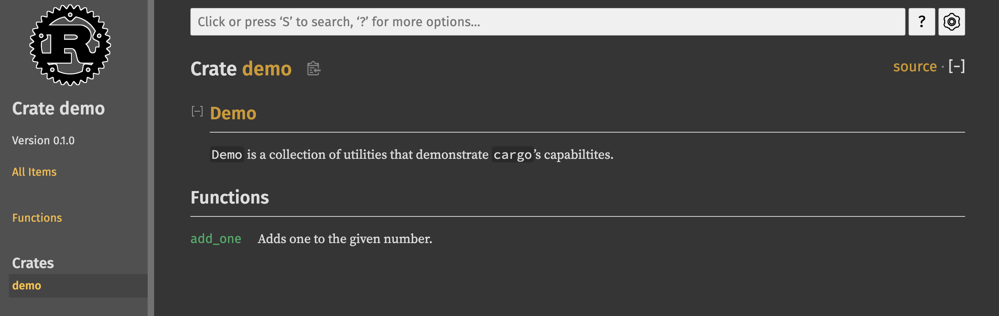
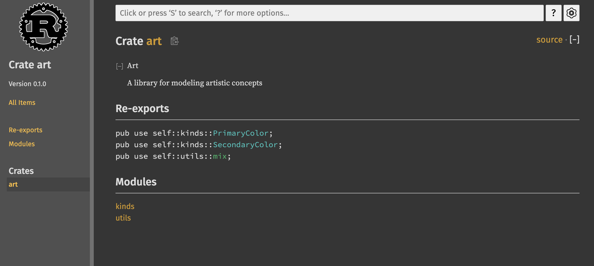

# More About Cargo and Crates.io

## Introduction

- This chapter covers some advanced features of `cargo` including how to:
    - Customize your build through release profiles
    - Publish libraries on `crates.io`
    - Organize large projects with workspaces
    - Install binaries from `crates.io`
    - Extend Cargo using custom commands
- For those that this chapter does not cover, check the Cargo [documentation](https://doc.rust-lang.org/cargo/)

## Customize Your Builds with Release Profiles

- Release profiles are customizable profiles with different configurations that allow a programmer to have more control over various options for compiling code
- Each profile is configured independently of others
- Cargo has two main profiles:
    - `dev` ⇒ that runs when you run `cargo build`
    - `release` ⇒ that runs when you run `cargo build --release`
- The `dev` profile is defined with good defaults for development and the `release` profile with good defaults for release builds
- These names may be familiar from the output of the build commands:
    
    ```rust
    $ cargo build
        Finished dev [unoptimized + debuginfo] target(s) in 0.0s
    $ cargo build --release
        Finished release [optimized] target(s) in 0.0s
    ```
    
- You can add `[profile.*]` sections to override the preset defaults in the `Cargo.toml` file
- For example:
    
    ```rust
    [profile.dev]
    opt-level = 0
    
    [profile.release]
    opt-level = 3
    ```
    
    Here, the `opt-level` setting controls the number of optimizations Rust will apply to your code, with a range from 0 to 3.
    
    Adding more optimizations increases compile time. In dev environment, where you are testing out your code, a slower running code that compiles faster is preferable; hence, the default value for `dev` is 0. Releases on the other hand happen infrequently but the resulting code runs for a long period of time so the maximum number of optimizations is desirable; hence, the value set to 3.
    
### Quiz

1. When you run `cargo build` with no additional flags, which profile is used by default?
    - Ans

        `dev`

## Publish a Crate to `Crates.io`

- Just like we can download crates from `crates.io`, we can also pubish our own crates to it.
- Rust and Cargo have features that make you published package easier for people to find and use.

### Making Useful Documentation Comments

- Accurately documenting your packages helps other users to know how and when to use them, so it’s worth investing time to write documentation
- Besides commenting your code with `//`, Rust also provides a particular type of comment called the `documentation comment` that will generate HTML documentation
- The HTML displays the contents of documentation comments for public API items intended for programmers interested in knowing how to *use* your crate rather than how you crate is *implemented*
- Documentation commnets use three slashes `///` and support Markdown notation for formatting text
- These texts should be placed just **before** the thing that is being documented
- For example:
    
    ```rust
    /// Adds one to the given number.
    ///
    /// ## Examples
    /// ```
    /// let arg = 5;
    /// let answer = demo::add_one(arg);
    ///
    /// assert_eq!(6, answer);
    /// ```
    pub fn add_one(x: i32) -> i32 {
        x + 1
    }
    ```
    
    Here, we have added a documentation comment to the function `add_one` that:
    
    - Starts with what the function does
    - Has a section named `Examples`
    - And some code that demonstrates how the function works
- To generate the HTML documentation for the above code, we can run `cargo doc` which runs the `rustdoc` tool distributed with Rust and puts the generated HTML documentaton in the `target/doc` directory
- For convenvience, running `cargo doc --open` will build the HTML for the current code’s documentation (as well as the documentation for all your crate’s dependencies) and open the result in a web browser:
    
    
    
#### Commonly Used Sections

Beside the `Examples` section, here are a few more sections that crate authors usually employ:

- `Panics`
    
    The scenarios in which the function being documented could panic
    
- `Errors`
    
    If the function returns a `Result`, describing the kinds of errors that might occur and what conditions might cause those errors to be returned can be helpful to callers so that they can deal with them
    
- `Safety`
    
    If the function is `unsafe` to call (more on this later), there should be a section explaining why the function is unsafe and covering the invariants that the function expects its callers to uphold.
    
#### Documentation Comments as Tests

- Adding code blocks in your documentation not only demonstrates how your code works but also provides an additional bonux — running `cargo test` will also run the code examples in your documentation as tests!

> Nothing is better than documentation with examples but nothing is worse than examples that don’t work because the code has changed since the documentation was written
>
- Rust’s ability to test code inside documentation makes sure that our documentation stays in sync with our code

#### Commenting Contained Items

- There is another style of comment documentation that begins with `//!`
- This type of documentation refers to the code segment that contains the dcoumentation, rather than the code that follows the documentation
- By convention, these are used in the crate root file `src/lib.rs` or inside a module to document the crate or the module as a whole
- For example, to document the `demo` crate as a whole that contains the `add_one` function, we add this type of documentation in the `src/lib.rs` file:
    
    ```rust
    //! ## Demo
    //!
    //! `Demo` is a collection of utilities that demonstrate `cargo`'s capabiltites.
    
    /// Adds one to the given number.
    ///
    /// ## Examples
    ...
    ```
    
- Now, when we run `cargo doc --open`, we’ll see:
    
    
    
### Quiz

1. Say you are publishing a library, and you want to write documentation about the entire library at the top of the `lib.rs` file. The documentation should be prefixed with the following comment syntax:
    - Ans

        `//!`

2. Say you are creating a library `worldly` with the following function `lib.rs`:
    
    ```rust
    /// Adds the string "world" to `s`.
    ///
    /// ## Example
    /// ```
    /// let mut s = String::new();
    /// worldly::add_world(&mut s);
    /// assert_eq!(s, "Hello world");
    /// ```
    pub fn add_world(s: &mut String) {
        s.push_str("world");
    }
    #[test]
    fn test_add_world() {
        let mut s = String::new();
        add_world(&mut s);
        assert_eq!(s, "world");
    }
    ```
    
    If you run `cargo test`, will any test fail?
    
    - Ans

        Yes

        The doc example is incorrect (no `hello`)

### Exporting a Convenient Public API with `pub use`

- The structure of your public API is a major concern when publishing a crate — people might have difficulty finding the pieces they want if your crate has large module hierarchy
- The structure that might make sense to you when you’re building your crate might not be very convenient to your users
- You might find it convenient to organize your structs in a hierarchy containing multiple levels but then people who want to use a type you’ve defineddeep in the hierarchy might have trouble finding out that type exists
- Users might also be annoyed at having to enter `use my_crate::some_module::another_module::UsefulType;` rather than `use my_crate::UsefulType;`.
- The good news is that if the structure is *not* convenient for others to use from another library, you don’t have to rearrange your internal organization: instead you can re-export items to make a public structure that’s different from your private structure by using `pub use`
- Re-exporting makes a public item in one location and makes it public in another location, as if it were defined in the other location
- For example, say we made a library named art with the following:
    
    ```rust
    //! Art
    //!
    //! A library for modeling artistic concepts
    
    pub mod kinds {
        /// The primary colors according to the RYB color model.
        #[derive(Debug, PartialEq)]
        pub enum PrimaryColor {
            Red,
            Yellow,
            Blue,
        }
    
        /// The secondary colors according to the RYB color model.
        #[derive(Debug, PartialEq)]
    		pub enum SecondaryColor {
            Orange,
            Green,
            Purple,
        }
    }
    
    pub mod utils {
        use crate::kinds::*;
    
        /// Combines two primary colors in equal amounts to create a secondary color.
        ///
        /// Example:
        /// ```
        /// use art::utils::mix;
        /// use art::kinds::{PrimaryColor, SecondaryColor};
        ///
        /// let primary_color_1 = PrimaryColor::Yellow;
        /// let primary_color_2 = PrimaryColor::Red;
        /// let mixture = mix(primary_color_1, primary_color_2);
        /// assert_eq!(SecondaryColor::Orange, mixture)
        /// ``
        pub fn mix(pc1: PrimaryColor, pc2: PrimaryColor) -> SecondaryColor {
            if pc1 == PrimaryColor::Blue && pc2 == PrimaryColor::Red {
                SecondaryColor::Purple
            } else if pc1 == PrimaryColor::Blue && pc2 == PrimaryColor::Yellow {
                SecondaryColor::Green
            } else {
                SecondaryColor::Orange
            }
        }
    }
    ```
    
- From the doctest alone, we can see that anybody using this library crate will need to know a lot of things about our library — the user must know.that the `PrimaryColor` enum is located in the `kinds` module and the `mix` function inside the `utils` module. This creates a lot of confusion
- To remove the internal organization from the public API, we can modify the `art` library so as to export the items directly from the root of our library:
    
    ```rust
    //! Art
    //!
    //! A library for modeling artistic concepts
    
    pub use self::kinds::{PrimaryColor, SecondaryColor};
    pub use self::utils::mix;
    ...
    ```
    
    With this approach, we can access the enums and the function directly from the library:
    
    ```rust
    use art::{mix, PrimaryColor, SecondaryColor};
    ```
    
- The API documentation now shows:
    
    
    
    This makes it easier to both find and use the items, while still allowing these to be accessed with their internal structure as before
    
- Using `pub use` decouples your library’s internal structure from how it is exposed to your users.
- However, creating a useful public API is an art rather than a science. So, you’ll need to iterate quite a bit before you find the right structure for your API

### Setting up a [crates.io](http://crates.io) account

- To set up an account, log in to `[crates.io](http://crates.io)` with your GitHub
- Then, go to `[crates.io/me](http://crates.io/me)` to get your API token
- Finally, login with `cargo`:
    
    ```rust
    cargo login <api_token>
    ```
    
### Adding Metadata to a New Crate

- Before publishing your crate, you will need to add some metadata in the `[package]` section of your `Cargo.toml` file
- Your crate will need a unique name — crate names on `[crates.io](http://crates.io)` are allocated on a first-come, first-served basis:
    
    ```rust
    [package]
    name = "my_unique_crate"
    ```
    
- Even if the name is unique, if you try to publish it with `cargo publish`, you will get an error:
    
    ```rust
    $ cargo publish
        Updating crates.io index
    warning: manifest has no description, license, license-file, documentation, homepage or repository.
    See https://doc.rust-lang.org/cargo/reference/manifest.html#package-metadata for more info.
    --snip--
    error: failed to publish to registry at https://crates.io
    
    Caused by:
      the remote server responded with an error: missing or empty metadata fields: description, license. Please see https://doc.rust-lang.org/cargo/reference/manifest.html for how to upload metadata
    ```
    
- This is because your package is missing some important information:
    - a description so that users know what your crate does
    - a license so that users know what terms they can use it under
- The description can be a just a sentence or two that explains what your crate does
- The license must be a *license identifier value* as described in [Linux Foundation’s Software Package Data Exchange (SPDX](http://spdx.org/licenses/))
- For example:
    
    ```toml
    [package]
    name = "my_unique_crate"
    version = "0.1.0"
    edition = "2021"
    description = "A unique crate"
    license = "MIT OR Apache-2.0" ## dual license
    ```
    
### Publishing to Crates.io

- Finally, to publish your crate, you can run `cargo publish`
- However, this is a permanent action — the version can never be overwritten, and the code cannot be deleted
- One major goal of `[crates.io](http://crates.io)` is to act as a permanent archive of code so that builds that depend upon any crate on there will continue to work in perpetuity
- However, there is no limit to the number of versions you can publish for your crate

### Publishing a New Version of an Existing Crate

- For this, you can simply change the `version` value specified in your crate’s `Cargo.toml` file and republish
- Make sure that you use the [Semantic Versioning Rules](http://semver.org/) to decide what an appropriate next version number is based on the kinds of changes you’ve made

### Deprecating Versions from [Crates.io](http://Crates.io)

- Although you can’t remove previous versions of your crate, you can prevent any future projects from adding them as a dependency
- You can do this by using the `cargo yank` command:
    
    ```rust
    cargo yank --vers 1.0.1
    ```
    
- This prevents new projects from depending on that version while allowing all existing projects that depend on it to continue
- This essentially means that no project with a `Cargo.lock` will ever break and any future Cargo.lock file will not reference the yanked version
- You can also undo a yank:
    
    ```rust
    cargo yank --vers 1.0.1 --undo
    ```
    
### Quiz

1. Say you are publishing a library `foobar v0.1.0`. After running `cargo publish`, you realize there is a bug in one of your functions. Which of the following best describes how to overwrite the published crate at the same `v0.1.0` version?
    - Ans

        It is impossible to overwrite a published crate at a given version

2. Which of the following steps is NOT required to publish a crate to [Crates.io](http://crates.io/)?
    - Ans

        Adding documentation to each public function in the crate

        **Context**: Adding documentation to public functions is certainly recommended, but not required by default. Note that if you want Rust to treat undocumented code as an error, you can add the following statement at the root of your library:

        ```rust
        #![deny(rustdoc::missing_docs)]
        ```

## Cargo Workspaces

- As your project grows, you might find that the library crate needs to be split into smaller library crates
- Cargo offers a feature called *workspaces* that help manage multiple libraries within the same crate

### Creating a Workspace

- A *workspace* is a set of packages that share the same `Cargo.toml` file and output directory
- As a demonstration, we’ll create a crate with a binary and two libraries — the binary depending upon the two libraries
- One library will provide an `add_one` function while the other will provide an `add_two` function
- These three crates will be part of the same workspace
- First, we’ll create our workspace directory and change into it:
    
    ```rust
    mkdir add
    cd add
    ```
    
- Then, we’ll create a `Cargo.toml` file with:
    
    ```rust
    [workspace]
    
    members = [
      "adder",
    ]
    ```
    
- Next, we’ll create the `adder` binary crate:
    
    ```rust
    cargo new adder
    ```
    
- At this point, we can build the project with `cargo build` and it will create a single `target` directory at the root of the workspace — the `adder` package does not have its own `target` directory
- This is so because crates within a workspace are supposed to depend on each other — by sharing the same target directory, crates can avoid unnecessary rebuildling (because otherwise, each crate would have to build the other crates in the workspace as well)

### Creating the Second Package in the Workspace

- First, add the new member in the `Cargo.toml` at the root of the workspace:
    
    ```rust
    [workspace]
    
    members = [
      "adder",
      "add_one",
    ]
    ```
    
- Then, create a new library crate named `add_one`:
    
    ```rust
    cargo new --lib add_one
    ```
    
- This should create the following directory structure:
    
    ```rust
    ├──  add_one/
    │  ├──  src/
    │  │  └──  lib.rs
    │  └──  Cargo.toml
    ├──  adder/
    │  ├──  src/
    │  │  └──  main.rs
    │  └──  Cargo.toml
    ├──  Cargo.lock
    └──  Cargo.toml
    ```
    
- Cargo does not assume that crates in a workspace will depend on each other, so we need to be explicit about the dependency relationships
- So, in `adder` in the `Cargo.toml` file, we add:
    
    ```rust
    [package]
    name = "adder"
    version = "0.1.0"
    edition = "2021"
    
    ## See more keys and their definitions at https://doc.rust-lang.org/cargo/reference/manifest.html
    
    [dependencies]
    add_one = { path = "../add_one" }
    ```
    
- We can now use the `add_one` library in our `adder` binary:
    
    ```rust
    fn main() {
        let num = 3;
        println!("Hello, world! {num} + 1 = {}", add_one::add_one(num));
    }
    ```
    
- When we run `cargo run` in the workspace, we get:
    
    ```rust
    ╰─λ cargo run            
        Finished dev [unoptimized + debuginfo] target(s) in 0.01s
         Running `target/debug/adder`
    Hello, world! 3 + 1 = 4
    ```
    
    We can also run the binary crate explicitly with `cargo run -p adder`
    
### Depending on an External Package in a Workspace

- There is only one top-level `Cargo.lock` file in the workspace
- This means that if we include two separate dependencies in the `Cargo.toml` file of the included packages, only one version of the package gets resolved (if the versions are within the semantic versioning rules; if the two packages use two different major/minor versions, the two different versions will be resolved and downloaded separately)
- This ensures that the packages in the workspace are always compatible with each other
- Another advantage is that only one dependency gets downloaded while building the workspace
- However, to use it in other crates, we must specify it in their `Cargo.toml` files as well!

### Adding a Test to a Workspace

- Running `cargo test` runs all tests in the workspace
- To run the tests for a particular package, we can specify the package with the `-p` flag:
    
    ```rust
    cargo test -p add_one
    ```
    
### Publishing Packages

- Each crate in a workspace needs to be published separately
- For this, you can use the `-p` flag with the `cargo publish` command:
    
    ```rust
    cargo publish -p add_one
    ```
    
### Quiz

1. Consider a workspace with the following structure:
    
    ```text
    ├── Cargo.lock
    ├── Cargo.toml
    └── crates
        ├── a
        |   ├── lib.rs
        |   └── Cargo.toml
        └── b
            ├── lib.rs
            └── Cargo.toml
    ```
    
    With the following content in each file:
    
    ```rust
    // crates/b/lib.rs
    pub fn f() {}
    ```
    
    ```toml
    ## crates/a/Cargo.toml
    [dependencies]
    b = {path = "../b"}
    ```
    
    Which of the following is the correct path to refer to `f` inside of `a/lib.rs`?
    
    - Ans

        `b::f`

2. Consider a workspace with three packages `a`, `b`, and `c`. Their respective manifests are:
    
    ```toml
    ## a/Cargo.toml
    [dependencies]
    rand = "0.8.4"
    
    ## b/Cargo.toml
    [dependencies]
    rand = "0.7.3"
    
    ## c/Cargo.toml
    [dependencies]
    rand = "0.8.5"
    ```
    
    How many different versions of `rand` will be used when compiling all packages in the workspace? Write your answer as a digit, e.g. 0, 1, so on.
    
    - Ans

        2

        **Context**: According to the rules of semantic versioning, `a` and `c` will both share the latest patch of the minor version `0.8`. `b` will use the latest patch of the minor version `0.7`. So two versions in total will be used.

## Installing Binaries

- To install a binary crate, we can use:
    
    ```rust
    cargo install <binary name>
    ```
    
    For example:
    
    ```rust
    cargo install ripgrep
    ```
    
- Only binary crates (crates with `src/main.rs`) can be installed this way
- All binaries installed with this are stored in the installation root’s `bin` folder
- The default location is `$HOME/.cargo/bin`
- Make sure that this path is in your `$PATH` variable to be able to use the installed packages

## Extending Cargo with Custom Commands

- We can add custom commands to cargo without having to rebuild cargo ourselves
- To run a binary called `something` installed in your `$PATH`, you can simply run: `cargo something`
- We can list all available commands by using `cargo --list`
