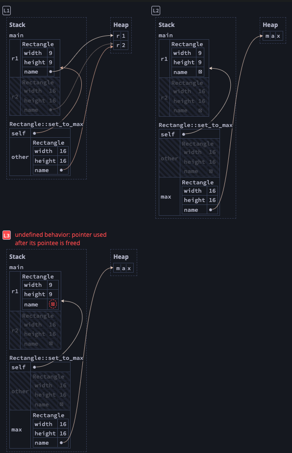

# Structs
## Introduction

- Used to structure related data
- A custom data type that lets you package together and name related values that make up a meaningful group
- Similar to Objects in OOP

## Defining and Instantiating

- Like tuples, they can hold values of different types
- Unlike tuples, these values can be named which gives them more flexibility
- Example:
    
    ```rust
    struct User {
    	active: bool,
    	username: String,
    	email: String,
    	sign_in_ocunt: u64,
    }
    
    fn main() {
    	let mut user1 = User {
    			email: String::from("someone@somewhere.com"),
    			username: String::from("someusername"),
    			active: true,
    			sign_in_count: 1,
    	},
    }
    ```
    
- The values are stored in either heap or stack depending upon the data type
- As shown above, the order of definition does not have to match the order of declaration
- To access fields in a struct, we use `dot` (`.`) notation:
    
    ```rust
    user1.email = String::from("anotherone@somewhere.com");
    ```
    
- Note that to change any field in a struct, the entire struct has to be mutable. Rust does not allow individual fields to be mutable/immutable.
- Also note that we are using the owned-type `String` instead of something like `&str` because we want each instance of this struct to own all its data and for that data to be valid for as long as the struct is valid.
- There is a way for structs to store references to data owned by something else but to do so requires the use of `lifetimes` (which are discussed much later).

### Field Init Shorthand

- Just like in languages like JavaScript, we can instantiate a field in a struct by condensing the form `<field_name>: <field_name>` with just `<field_name>,`. For example:
    
    ```rust
    fn build_user(email: String, username: String) -> User {
    	User {
    		active: true,
    		username, // :username not necessary
    		email,
    		sign_in_count: 1,
    	}
    }
    ```
    

### Creating a struct from another struct

- Again, just like in languages like JavaScript, we can spread a struct inside another struct and override certain fields that are different:
    
    ```rust
    let user2 = User {
    	email: String::from("someonedifferent@somewhere.com"),
    	..user1
    }
    // this is the same as:
    let user2 = User {
    	email: String::from("someonedifferent@somewhere.com"),
    	active: user1.active,
    	username: user1.username,
    	sign_in_count: user1.sign_in_count,
    }
    ```
    
- Note, however, that with this construct, the `user1` struct has now **moved** and cannot be used!
- This is the case because `email` is of `String` type that does not implement the `Copy` trait and therefore, is moved instead. Copying over types that do implement the `Copy` trait do **not** render `user1` unusable.

### Using Tuple Structs Without Names to Create Different Types

- Tuple structs have added meaning that the Struct type provides but without names associated with their fields — they just have types for their fields
- Example:
    
    ```rust
    struct Color(i32, i32, i32);
    struct Point(i32, i32, i32);
    
    fn main() {
    	let black = Color(0, 0, 0);
    	let origin = Point(0, 0, 0);
    }
    ```
    
- Note that the two structs defined in the above example are of different types even though their underlying representation and values are the same.
- In all other aspects, they behave in the same way that tuples do.

### Unit-like Structs Without Any Fields

- We can also define a struct that does not have any fields
- This type of struct is called `unit-like struct` because the behave similarly to `()`, the unity type.
- Example:
    
    ```rust
    struct AlwaysEqual;
    
    fn main() {
    	let subject = AlwaysEqual;
    }
    ```
    
- The advantage of this type of struct is that we can add behavior to this type of struct without needing to define any explicit fields.
- For example, in the above, we can add a behavior to the struct such that two structs of the `AlwaysEqual` struct are always equal.

### Borrowing Fields of a Struct

- Rust’s borrow-checker will track ownership at both the struct-level and the field-level.
- Example:
    
    ```rust
    struct Point { x: i32, y: i32 };
    
    let mut p = Point { x: 0, y: 0 }; // p: RWO, p.x: RWO, p.x: RWO
    
    let x = &mut p.x; // p: null, p.x: null, p.y: RWO, x: RO, *x: RW
    
    *x += 1; // p: RWO, p.x: RWO, p.y: RWO after scope of x end
    
    println!("{}, {}", p.x, p.y); 
    ```
    
    Here, when we borrow `p.x`, both `p` and `p.x` temporarily lose all their permissions while `p.y` does not. So, if we try to use `p` while it is being borrowed (move `println!` before `*x += 1;`, we get an error:
    
    ```rust
    error[E0502]: cannot borrow `p.x` as immutable because it is also borrowed as mutable
      --> src/main.rs:10:24
       |
    8  |     let x = &mut p.x;
       |             -------- mutable borrow occurs here
    9  |
    10 |     println!("{}, {}", p.x, p.y);
       |                        ^^^ immutable borrow occurs here
    11 |     *x += 1;
       |     ------- mutable borrow later used here
       |
       = note: this error originates in the macro `$crate::format_args_nl` which comes from the expansion of the macro `println` (in Nightly builds, run with -Z macro-backtrace for more info)
    ```
    

### Quiz

- Determine whether the program will pass the compiler. If it passes, write the expected output of the program if it were executed.
    
    ```rust
    struct Point {
      x: i32,
      y: i32,
    }
    fn main() {
      let mut a = Point { x: 1, y: 2 };
      a.x += 1;
      let b = Point { y: 1, ..a };
      a.x += 1;
      println!("{}", b.x);
    }
    ```
    
    The program does compile. `b` has a shallow copy of `a` (primitives). So, the output is `2` (value of `a.x` before initialization of `b`)
    
- Determine whether the program will pass the compiler. If it passes, write the expected output of the program if it were executed.
    
    ```rust
    struct Point {
      x: i32,
      y: i32,
    }
    fn main() {
      let mut p = Point { x: 1, y: 2 };
      let x = &mut p.x;
      let y = &mut p.y;
      *x += 1;
      *y += 1;
      println!("{} {}", p.x, p.y);
    }
    ```
    
    The program compiles with the output: `2 3`. Rust understands that `.x` refers to a different object than `.y`, so it is valid to take simultaneous mutable references to both fields.
    

## An Example Program Using Structs

- Let’s write a program that calculates the area of a rectangle.
    
    ```rust
    fn main() {
    		let width = 10u32;
        let height = 20u32;
    
        let area = calculate_area(width, height);
        println!("Area of the rectange = {width} x {height} = {area}");
    }
    
    fn calculate_area(width: u32, height: u32) -> u32 {
        width * height
    }
    ```
    
- The above program has a design issue in the `calculate_area` signature in that it is not clear from the signature alone that the two parameters it receives are in fact related (i.e, they are the dimensions of the same object namely a rectangle)
- One way to show that these values are related is to use a tuple for `width` and `height`:
    
    ```rust
    fn calculate_area(dimensions: (u32, u32)) -> u32 {
    	dimensions.0 * dimensions.1
    }
    ```
    
    - This version of the code makes it clear that the two parameters are related but we end up losing the meaning of these parameters because tuples do not allow naming of its members.
    - If we want to know exactly which one is the height and which one is the width, we’d have to remember their corresponding indices, which is not ideal.
- A much better way to do this is to use structs instead:
    
    ```rust
    struct Rect {
        width: u32,
        height: u32,
    }
    
    fn calculate_area(rect: &Rect) -> u32 {
        rect.height * rect.width
    }
    ```
    
    - In the above program, it is clear that the function accepts two **related** parameters as well what those two parameters represent.
    - Also note that we are accepting a reference to the struct and not the copy of it as it is not necessary to own the struct for the sake of the function.

### Adding Useful Functionality with Derived Traits

- It would be useful to print an instance of a `Rect` while debugging our program and see the values for all of its fields.
- In this case, the `println!` macro fails us. If we try to use it, we will get the following error:
    
    ```rust
    error[E0277]: `Rect` doesn't implement `std::fmt::Display`
    ```
    
- Primitive types like an `int32` have the `Display` trait implemented on them since there is only one way to output these primitive types
- For structs, it is a lot less clear how they should be formatted and so `Display` is not implemented on them by default.
- There is another trait called `Debug` that we *can* use. To use this, we need to use `:?` inside the curly braces in the `println!` macro. However, structs do not implement this trait either.
- However, Rust *does* include functionality to print out debugging information but we have to explicitly opt-in to make that functionality available for our struct.
- To do this, we add the outer attribute `#[derive(Debug)]` just before the struct definition:
    
    ```rust
    #[derive(Debug)]
    struct Rect {
        width: u32,
        height: u32,
    }
    
    fn main() {
    
    		let rect = &Rect {
            height: 10u32,
            width: 20u32,
        };
    
        let area = rectangle::calculate_area(rect);
        println!("Area of the rectange {:?} = {area}", rect);
    }
    ```
    
    This will output:
    
    ```rust
    Area of the rectange Rect { width: 20, height: 10 } = 200
    ```
    
- An alternative is to use the `dbg!` macro that:
    - takes ownership of an expression (as opposed to `println!` that takes a reference)
    - prints the file and line number of where that `dbg!` macro was invoked along with the resultant value of that expression, and
    - returns the ownership of the value
    
    Example:
    
    ```rust
    		let scale = 2;
        let rect = &Rect {
            height: dbg!(10u32 * scale),
            width: 20u32,
        };
    
        let area = rectangle::calculate_area(rect);
        println!("Area of the rectange {:?} = {area}", rect);
    ```
    
    The above outputs:
    
    ```rust
    [src/main.rs:21] 10u32 * scale = 20
    Area of the rectange Rect { width: 20, height: 20 } = 400
    ```
    

### Quiz

- Determine whether the program will pass the compiler. If it passes, write the expected output of the program if it were executed.
    
    ```rust
    #[derive(Debug)]
    struct Rectangle {
      width: u32,
      height: u32,
    }
    fn main() {
      let rect1 = Rectangle {
        width: 30,
        height: 50,
      };
      let a = area(rect1);
      println!("{} * {} = {}", rect1.width, rect1.height, a);
    }
    fn area(rectangle: Rectangle) -> u32 {
      rectangle.width * rectangle.height
    }
    ```
    
    ⇒ The program does **NOT** compile. This is because the `area` function takes ownership of `rect1` and does not return the ownership. So, it cannot be used in the call to the `println!` macro.
    
- Which statement best describes a difference between the `Display` and `Debug` traits?
    
    ⇒ `Display` is for presenting values to an end-user, while `Debug` is for developers' internal use
    

## Method Syntax

- Methods are similar to *functions*
- However, methods are defined within the context of a struct (or an enum or a trait object) and their first parameter is always `self`.

### Defining Methods

- Let’s change the area function as a method of the `Rect` struct:
    
    ```rust
    #[derive(Debug)]
    struct Rect {
        width: u32,
        height: u32,
    }
    
    impl Rect { // methods are defined within this impl block
        fn area(&self) -> u32 { // &self is short for self: &self
            self.height * self.width
        }
    }
    
    ```
    
    We can now calculate the area simply with:
    
    `rect.area()`
    
- A method can take ownership of `self`, or borrow `self` immutably or mutably
- Here, we use `&self` for the same reason we used `&Rect` before.
- A method taking ownership of `self` is rare except in cases where the method transforms `self` and we need to prevent access to it from the caller until the transformation is complete.
- The main reason for using methods instead of functions that take a struct as input is code organization. By defining functions that apply on the struct within an `impl` block on the struct, we are making it easy for other users of our struct to find functions that they can apply on our struct.

### Naming Methods

- We can create methods with the same name as one of the fields in the struct
- Rust is smart enough to know that if we are trying to call the property with parenthesis, it is a method call.
- The following code is perfectly valid:
    
    ```rust
    impl Rect {
    	fn width(&self) -> bool {
    		self.width > 0
    	}
    }
    ```
    
- Note that, we can use `self.width` directly (instead of `(*self).width` **because Rust has a feature called `automatic referencing and dereferencing` by virtue of which Rust automatically adds in **`&`, `&mut`, or *`*`* so that the call matches the method signature.
- This pattern is used for `getters` that are simply methods that return the value of the field that they are named after. This is mostly the case when the fields are made private and the function is used to access the value of the field so that other users of the struct cannot access the field directly (more on this later).

### Method with More Parameters

- Let’s define a method called `can_hold` that checks if another rectangle can fit within itself.
- This method should accept the other Rectangle as a parameter to it:
    
    ```rust
    		pub fn can_hold(&self, other: &Rect) -> bool {
            self.width >= other.width && self.height >= other.height
        }
    ```
    
    We can then use it as:
    
    ```rust
    		let scale = 2;
        let rect = Rect {
            height: dbg!(10u32 * scale),
            width: 20u32,
        };
    
        let another_rect = Rect {
            height: 10,
            width: 5,
        };
    
    		println!(
            "{:?} can hold {:?} ? {}",
            rect,
            another_rect,
            rect.can_hold(&another_rect) // `&rect` is inferred
        );
        println!(
            "{:?} can hold {:?} ? {}",
            another_rect,
            rect,
            another_rect.can_hold(&rect) 
        );
    ```
    
    The above will output:
    
    ```rust
    Rect { width: 20, height: 20 } can hold Rect { width: 5, height: 10 } ? true
    Rect { width: 5, height: 10 } can hold Rect { width: 20, height: 20 } ? false
    ```
    

### Associated Functions

- All functions inside an `impl <Type>` block are called *associated functions* as they are associated with the `Type`.
- We can define associated functions that do not have `self` as the first parameter and are thus, **not** methods.
- Such associated functions are generally used as `constructors` that return a new instance of the type:
    
    ```rust
    // associated fn that is **not** a method
        pub fn square(size: u32) -> Self {
            Self {
                width: size,
                height: size,
            }
        }
    ```
    
- We can use the above as follows:
    
    ```rust
    let square_from_rect = Rect::square(10);
        println!(
            "Area of the square {:?} is {}",
            square_from_rect,
            square_from_rect.area()
        );
    ```
    
    The call to `square` is namespaced by the struct: the `::` syntax is used for both associated functions and namespaces created by modules (discussed later)
    

### Multiple `impl` Blocks

- We can have multiple `impl` blocks that implement different associated functions
- This is a perfectly valid syntax although not necessary:
    
    ```rust
    // methods are defined within this impl block
    impl Rect {
        // &self is short for self: &self
        // self is an alias for the type impl block is for
        // in this case `Rect`
        fn area(&self) -> u32 {
            self.height * self.width
        }
    
        fn can_hold(&self, other: &Rect) -> bool {
            self.width >= other.width && self.height >= other.height
        }
    }
    
    impl Rect {
        // associated fn that is **not** a method
        fn square(size: u32) -> Self {
            Self {
                width: size,
                height: size,
            }
        }
    }
    ```
    

### Method Calls are Syntactic Sugar for Function Calls

- Each implementation of a method can also be represented directly with a normal function call namespaced by the associated struct.
- For example, the following calls are equivalent:
    
    ```rust
    let area1 = rect.area();
    let area2 = Rect::area(&rect);
    
    rect.set_width(2);
    Rect::set_width(&mut rect, 2);
    ```
    
- Rust will automatically insert as many references/dereferences as necessary to match the call for `self`. For example:
    
    ```rust
    let rect = &mut Box::new(Rect {
    	width: 1,
    	height: 2,
    });
    
    let area1 = rect.area();
    let area2 = Rect::area(&**rect); 
    // & because &self
    // (*r) to deref the Box
    // *(*r) to deref the mutable borrow (&mut)
    ```
    

### Quiz

- What is the keyword for constructor functions in Rust?
    
    ⇒ None of the above. There is no special constructor method in Rust. The idiomatic way is to name such a method `new` but this is not enforced by the compiler.
    
- Determine whether the program will pass the compiler. If it passes, write the expected output of the program if it were executed.
    
    ```rust
    struct Point(i32, i32);
    fn main() {
      let p = Point(1, 2);
      impl p {
        fn x(&self) -> i32 { self.0 }
      }
      
      println!("{}", p.x());
    }
    ```
    
    ⇒ This program **DOES NOT** compile as the `impl` block must be defined on the struct type and not the struct instance.
    

### Methods and Ownership

- We will use the following running example method implementation to discuss ownership in the context of methods:
    
    ```rust
    impl Rect {    
        fn area(&self) -> u32 {
            self.width * self.height
        }
    
        fn set_width(&mut self, width: u32) {
            self.width = width;
        }
    
        fn max(self, other: Rectangle) -> Rectangle {
            Rectangle { 
                width: self.width.max(other.width),
                height: self.height.max(other.height),
            }
        }
    }
    ```
    

#### Reads and Writes with `&self` and `&mut self`

- When we instantiate the `Rect` with `let`, it has `R` and `O` permissions
- So, it is permissible to use both `area` and `max` methods because they both receive a non-mutable form of `Rect`.
    
    ```rust
    		let rect1 = Rect {
            width: 15,
            height: 25,
        };
    
        println!("Area = {}", rect1.area());
    
        let rect2 = Rect {
            width: 20,
            height: 10,
        };
    
        println!("Max Rect = {:?}", rect2.max(rect1));
    ```
    
- However, the call to `set_width` fails because it requires the `Rect` to be mutable (`W` permission that is not available).
- We will get the following error:
    
    ```rust
    error[E0596]: cannot borrow `rect1` as mutable, as it is not declared as mutable
      --> src/method_ownership.rs:10:5
       |
    10 |     rect1.set_width(30);
       |     ^^^^^^^^^^^^^^^^^^^ cannot borrow as mutable
       |
    help: consider changing this to be mutable
       |
    4  |     let mut rect1 = Rect {
       |         +++
    ```
    
- Here, the compiler tells us that the `rect1` should be defined as mutable for the method call to `set_width` to work.
- Also note that this method will fail if we have an immutable reference to a mutable `Rect` instance as well:
    
    ```rust
    		let mut rect1 = Rect {
            width: 15,
            height: 25,
        };
    
        println!("setting width to of rect1 to 30");
        rect1.set_width(30); // this is OK
    
        let rect1_ref = &rect1;
        rect1_ref.set_width(20); // this is NOT OK
    ```
    
- We will get the following error when using an immutable reference:
    
    ```rust
    error[E0596]: cannot borrow `*rect1_ref` as mutable, as it is behind a `&` reference
      --> src/method_ownership.rs:13:5
       |
    13 |     rect1_ref.set_width(20);
       |     ^^^^^^^^^^^^^^^^^^^^^^^ `rect1_ref` is a `&` reference, so the data it refers to cannot be borrowed as mutable
       |
    help: consider changing this to be a mutable reference
       |
    12 |     let rect1_ref = &mut rect1;
       |                     ~~~~~~~~~~
    ```
    

#### Moves with `self`

- Note that the `max` method takes `self` as a parameter.
- This means that this method takes ownership of the struct instance on which it is called
- The ownership is not returned and therefore, the instance becomes unusable after the call to `max`:
    
    ```rust
    		...
    		println!("Max Rect = {:?}", rect1.max(rect2));
    
        println!("Rect1 = {:?}", rect1);
    ```
    
    The above will produce the following error:
    
    ```rust
    error[E0382]: borrow of moved value: `rect1`
      --> src/method_ownership.rs:24:30
       |
    4  |     let mut rect1 = Rect {
       |         --------- move occurs because `rect1` has type `Rect`, which does not implement the `Copy` trait
    ...
    22 |     println!("Max Rect = {:?}", rect1.max(rect2));
       |                                       ---------- `rect1` moved due to this method call
    23 |
    24 |     println!("Rect1 = {:?}", rect1);
       |                              ^^^^^ value borrowed here after move
       |
    note: `Rect::max` takes ownership of the receiver `self`, which moves `rect1`
      --> src/rectangle.rs:26:16
       |
    26 |     pub fn max(self, other: Rect) -> Rect {
       |                ^^^^
       = note: this error originates in the macro `$crate::format_args_nl` which comes from the expansion of the macro `println` (in Nightly builds, run with -Z macro-backtrace for more info)
    ```
    
- A similar situation arises if we try to use a `self` method on a reference. `self` requires ownership that a `reference` (non-owning) does not provide. For example, the following `set_to_max` method fails:
    
    ```rust
    struct Rectangle {
        width: u32,
        height: u32,
    }
    impl Rectangle {    
      fn area(&self) -> u32 {
        self.width * self.height
      }
    
      fn set_width(&mut self, width: u32) {
        self.width = width;
      }
    
      fn max(self, other: Self) -> Self {
        let w = self.width.max(other.width);
        let h = self.height.max(other.height);
        Rectangle { 
          width: w,
          height: h
        }
      }
    
      fn set_to_max(&mut self, other: Rectangle) {
          *self = self.max(other);
      }
    }
    ```
    
    Here, `self.max(other)` call fails because `self` in this case is a mutable reference that does not provide ownership that `max` requires.
    
    We get the following error:
    
    ```rust
    error[E0507]: cannot move out of `*self` which is behind a mutable reference
      --> test.rs:23:17
       |
    23 |         *self = self.max(other);
       |                 ^^^^^----------
       |                 |    |
       |                 |    `*self` moved due to this method call
       |                 move occurs because `*self` has type `Rectangle`, which does not implement the `Copy` trait
       |
    ```
    
    #### Good Moves and Bad Moves
    
    - The above implementation of the `set_to_max` method is actually *safe*. This is because no unsafe operations like `double-free` or `null-pointer` reference occurs.
    - This in turn, is because the `Rect` struct does not hold any data on the heap
    - So, even if we are accessing “moved” data, it is technically safe should we copy the underlying data.
    - For this, we have to add the derived traits `Copy` and `Clone` to the `Rect` struct so that `self` is copied instead of moved.
        
        ```rust
        #[derive(Copy, Clone)]
        struct Rectangle {
            width: u32,
            height: u32,
        }
        
        impl Rectangle {    
          fn max(self, other: Self) -> Self {
            let w = self.width.max(other.width);
            let h = self.height.max(other.height);
            Rectangle { 
              width: w,
              height: h
            }
          }
          fn set_to_max(&mut self, other: Rectangle) {
              let max = self.max(other); // L2
              *self = max;
          }
        }
        
        fn main() {
            let mut rect = Rectangle { width: 0, height: 1 };
            let other_rect = Rectangle { width: 1, height: 0 }; // L1
            rect.set_to_max(other_rect); // L3
        }
        ```
        
        
        
        Note that both `other_rect` and `rect` are now cloned/copied in the call to methods that accept `self`
        
    - However, if the struct holds any data on the heap, then the operation becomes unsafe.
    - Consider the following code:
        
        ```rust
        struct Rectangle {
            width: u32,
            height: u32,
            name: String,
        }
        
        impl Rectangle {    
          fn max(self, other: Self) -> Self {
            let w = self.width.max(other.width);
            let h = self.height.max(other.height);
            Rect { 
              width: w,
              height: h,
              name: String::from("max")
            }
          }
          fn set_to_max(&mut self, other: Rectangle) {
              let max = self.max(other); // L2
              drop(*self); // L3 // This is usually implicit,
                           // but added here for clarity.
              *self = max;
          }
        }
        
        fn main() {
            let mut r1 = Rectangle { 
                width: 9, 
                height: 9, 
                name: String::from("r1") 
            };
            let r2 = Rectangle {
                width: 16,
                height: 16,
                name: String::from("r2")
            };
            r1.set_to_max(r2); // L1
        	}
        ```
        
        The above code results in an error in the implementation of `set_to_max`:
        
        ```rust
        error[E0507]: cannot move out of `*self` which is behind a mutable reference
          --> src/rectangle.rs:36:19
           |
        36 |         let max = self.max(other); // L2
           |                   ^^^^^----------
           |                   |    |
           |                   |    `*self` moved due to this method call
           |                   move occurs because `*self` has type `Rect`, which does not implement the `Copy` trait
           |
        note: `Rect::max` takes ownership of the receiver `self`, which moves `*self`
          --> src/rectangle.rs:27:16
           |
        27 |     pub fn max(self, other: Rect) -> Rect {
           |                ^^^^
        ```
        



- In the above, we call `set_to_max` on `r1` and `r2`. This is a move of `r2` and a mutable borrow of `r1`.
- In the call to `self.max(other)`, it consumes ownership of both `self` and `other`, and when `max` returns both `r1` and `r2` are deallocated from the heap.
- When we overwrite `*self`, Rust tries to drop the previous reference to `r1` (actually, `r1.name`) but since `r1` has already been deallocated, we get an undefined behavior of double-free.

 

<aside>
💡 When you see an error like “cannot move out of `*self`”, that’s usually because you’re trying to call a `self` method on a reference like `&self` or `&mut self` which can lead to a double-free which is undefined behavior.

</aside>

### Quiz

- Say you have a variable `v` of type `&mut Vec<i32>`, and you want to call the `len` method with the following signature:
    
    ```rust
    impl<T> Vec<T> {
      fn len(&self) -> usize {
        /* ... */
      }
    }
    ```
    
    If you try to compile the expression `v.len()`, which of the following statements best describes what happens?
    
    ⇒ It compiles, because the `&mut` reference is implicitly reborrowed as an `&` reference
    
    **Context**: The expression `v.len()` desugars to `Vec::len(&*v)`, which is a valid re-borrow of `v`, so this expression compiles. You cannot, however, pass `v` directly to `Vec::len`, since `&self` specifically refers to immutable references.
    
- Consider these two methods that increment a field of a struct. Which style would be more idiomatic for Rust?
    
    ```rust
    struct Point(i32, i32);
    impl Point {
      fn incr_v1(mut self)  { self.0 += 1; }
      fn incr_v2(&mut self) { self.0 += 1; }
    }
    ```
    
    ⇒ `incr_v2`
    
    **Context**: The `incr_v1` method is not idiomatic, because it consumes ownership of the `Point`. This means after calling `p.incr_v1()`, `p` would be unusable, which is probably not intended for this method.
    
- Determine whether the program will pass the compiler. If it passes, write the expected output of the program if it were executed.
    
    ```rust
    struct Point(i32, i32);
    impl Point {
      fn incr_x(&mut self) {
        self.0 += 1;
      }
    }
    fn main() {
      let mut p = Point(0, 0);
      p.incr_x();
      println!("{}", p.0);
    }
    ```
    
    ⇒ This program **DOES** compile with the output: `1`
    
- Determine whether the program will pass the compiler. If it passes, write the expected output of the program if it were executed.
    
    ```rust
    struct Point {
      x: i32,
      y: i32
    }
    impl Point {
      fn get_x(&mut self) -> &mut i32 {
        &mut self.x
      }
    }
    fn main() {
      let mut p = Point { x: 1, y: 2 };
      let x = p.get_x();
      *x += 1;
      println!("{} {}", *x, p.y);
    }
    ```
    
    ⇒ This program **DOES NOT** compile
    
    Because `get_x` mutably borrows all of `p`, a program cannot use `p` in any way until `x` is no longer used. Therefore reading `x` and `p.y` in the same line is an ownership error:
    
    ```rust
    error[E0502]: cannot borrow `p.y` as immutable because it is also borrowed as mutable
      --> src/quiz.rs:16:27
       |
    14 |     let x = p.get_x();
       |             --------- mutable borrow occurs here
    15 |     *x += 1;
    16 |     println!("{} {}", *x, p.y);
       |     ----------------------^^^-
       |     |                     |
       |     |                     immutable borrow occurs here
       |     mutable borrow later used here
       |
       = note: this error originates in the macro `$crate::format_args_nl` which comes from the expansion of the macro `println` (in Nightly builds, run with -Z macro-backtrace for more info)
    ```
